## 全面理解 JVM 虚拟机

[TOC]

JVM：Java 虚拟机，是Java程序运行的虚拟计算机环境。(后续讨论 JVM 都是以 [JDK 1.8](https://docs.oracle.com/javase/specs/jvms/se8/html/index.html) 为基础讨论，除非特殊说明)

### 1. JVM 的组成


整体流程： .java 文件 通过 javac 命令编译成 .class 文件，.class 文件加载进入 jvm 中，通过 加载 → 验证 → 准备 → 解析 → 初始化 → 使用 → 卸载 一系列的流程完成代码执行的整个生命周期。其中 JVM 组件包括两个系统和两个组件，两个系统分别为类加载子系统和执行引擎系统，而两个组件分别为运行时数据区（包括堆、栈、方法区等等）和本地方法库。

### 2. class 文件规范

#### 2.1 class 文件结构

编译 ByteCodeInterView.java 文件并打开，如下图所示：

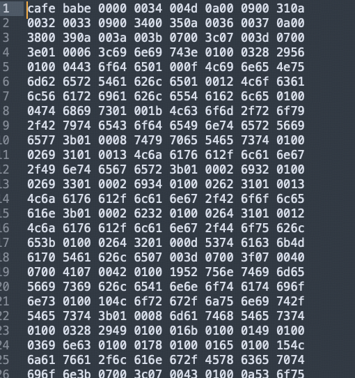

如图所示，展示的是一堆 16 进制的内容。空格隔开的部分代表了 8 个bit，⽽每⼀位代表的是 4 个 bit字节，也就是⼀个⼗六进制的数字。

class 文件有一些固定的规范：

* 文件开头必须以 CAFEBABE 开头
* 文件的 BABE 后边的 0000 代表的 minor version（次版本号，一般没用），再之后的 0034 代表的是 major version（主版本号）,0034 换算为 10 进制是 52，代表的是 JDK1.8。低于该版本则无法执行该文件。

再往后的内容不太容易理解，可以使用 javap -v target.classes.com.roy.ByteCodeInterView 查看该 class 的详细信息。如下图所示：


官网定义的class文件结构要求如下所示：


前⾯u4表示四个字节是magic魔数，⽽这个魔数就是不讲道理的 CAFEBABE 。

后⾯的两个u2，表示两个字节的版本号。

接下来，class⽂件的整体布局就⽐较明显了。其中常量池是最复杂的部分，包含了表示这个class⽂件所需要的⼏乎所有常量。⽐如接⼝名字，⽅法名字等等。⽽后⾯的⼏个部分，⽐如⽅法，接⼝等都是引⽤常量池中的各种变量。

#### 2.2 理解字节码指令

代码的字节码如下图所示：


这⾥每⼀行就是⼀个字节码指令。 JVM 虚拟机的字节码指令由⼀个字节⻓度的代表着某种特定操作含义的数字(称为操作码，OpCode)以及跟随其后的零⾄多个代表此操作所需要的参数(称为操作数，Operand)构成。其中操作数，可以是⼀个具体的参数，也可以是⼀个指向class⽂件常量池的符号引⽤，也可以是⼀个指向运⾏时常量池中的⼀个⽅法。⽐如第 0 ⾏ bipush 10，操作码就是 bipush，操作数就是 10。这个指令就占据了第 0 ⾏和第 1 ⾏两⾏。⽽有些操作码，如 astore_1，就只有⼀个操作码，没有操作数。

Java 虚拟机中的操作码的⻓度只有⼀个字节(能表示的数据是0～255)，这意味着 JVM 指令集的操作码总数不超过 256 条。这些指令相⽐于庞⼤的操作系统来说，已经是⾮常⼩的了。另外其中还有很多差不多的。 ⽐如aload_1，aload_2 这些，明显就是同⼀类的指令。具体可以参考[官网](https://docs.oracle.com/javase/specs/jvms/se8/html/jvms-6.html#jvms-6.5)

如果不考虑异常的话，那么 JVM 虚拟机执⾏代码的逻辑就应该是这样：

```
do{
从程序计数器中读取 PC 寄存器的值 + 1；
根据 PC 寄存器指示的位置，从字节码流中读取⼀个字节的操作码；
if(字节码存在操作数) 从字节码流中读取对应字节的操作数；
执⾏操作码所定义的操作；
}while(字节码流⻓度>0)
```

#### 2.3 字节码指令解读案例

```java
Integer i1 = 10;
Integer i2 = 10;
System.out.println(i1 == i2);//true

Integer i3 = 128;
Integer i4 = 128;
System.out.println(i3 == i4);//false
```

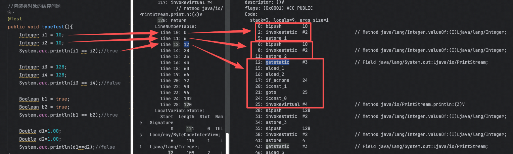

如图所示，以前三行代码为例，分别对应着字节码 LineNumberTable 中的映射，LineNumberTable 中标注着第 10 行对应字节码的 0-5，11行代码对应字节码的 6-11，12行代码对应字节码的 12-27。

可以看到，在执行 astore 往局部变量表中设置值之前，先调用了下 Integer.valueOf 方法。

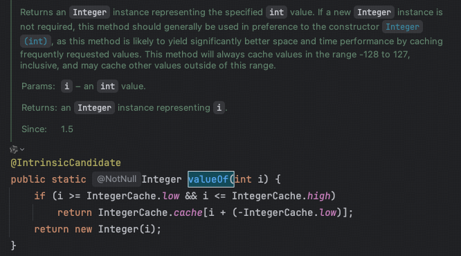

如图所示，Integer.valueOf 方法会先判断该值是否在缓存中，如果在缓存中则直接返回缓存中的值，不在缓存中则创建一个 Integer 对象并返回。

IntegerCache 内部维护的 cache 存储的是 -128~127 的 Integer 对象，low 和 high 分别为 -128 和 127，因此在这个区间取数的时候，拿到的对象地址都是相同的。

另外，在这个过程中，我们也看到了在JVM中，是通过⼀个`invokestatic`指令调⽤⼀个静态⽅法。实际上JDK中还有以下⼏个跟⽅法调⽤相关的字节码指令:

* invokevirtual 指令:⽤于调⽤对象的实例⽅法，根据对象的实际类型进⾏分派(虚⽅法分派)，这也是 Java 语⾔中最常⻅的⽅法分派⽅式。
* invokeinterface 指令:⽤于调⽤接⼝⽅法，它会在运⾏时搜索⼀个实现了这个接⼝⽅法的对象，找出适合的⽅法进⾏调⽤。
* invokespecial 指令:⽤于调⽤⼀些需要特殊处理的实例⽅法，包括实例初始化⽅法私有⽅法和⽗类⽅法。
* invokestatic 指令:⽤于调⽤类静态⽅法(static ⽅法)。
* invokedynamic 指令:⽤于在运⾏时动态解析出调⽤点限定符所引⽤的⽅法。并执⾏该⽅法。前⾯四条调⽤指令的分派逻辑都固定在 Java 虚拟机内部，⽤户⽆法改变，⽽invokedynamic指令的分派逻辑是由⽤户所设定的引导⽅法决定的。 Java 从诞⽣到现在，只增加过⼀条指令，就是invokedynamic。

⽅法调⽤指令与数据类型⽆关，⽽⽅法返回指令是根据返回值的类型区分的。包括ireturn(返回值是boolean,byte,char,short,int)，lreturn, freturn, return , areturn 。另外还有⼀条return指令供声明为void的⽅法、实例初 始化⽅法、类和接⼝的类初始化⽅法使⽤。

#### 2.4 深入理解字节码 try-cache-finally 的执行流程

在之前解读字节码时，你们可能会注意到，在字节码指令的上⾯，有⼀个异常表的标签。这个异常表就是⽤来控制抛出异常的情况下的处理流程。我们⽤下⾯⼀个简单代码来做演示：

```java
public static void main(String[] args) {
    try {
        System.out.println(1/0);
    } catch (Exception e) {
        System.out.println("捕获异常");
    } finally {
        System.out.println("finally");
    }
}
```

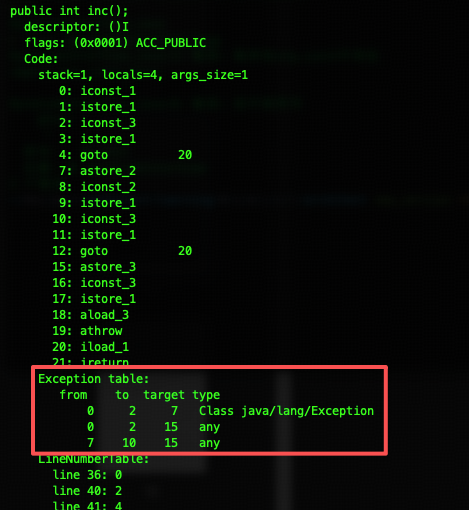

其实，对照源代码，你⼤概也应该能够猜到这个异常表的表现形式。异常表中每⼀⾏代表⼀个执⾏逻辑的分⽀。表示 当字节码从《起始 PC》到《结束 PC》(不包含结束 PC)之间出现了类型为《捕获异常》或者其⼦类的异常时，就跳转到《跳转 PC》处进⾏处理。

可以看到，这⾥定义了三条明显的执⾏路径，分别是：
1. 如果try语句块中出现了属于 Exception 或者其⼦类的异常，转到catch语句块处理。
2. 如果try语句块中出现了不属于 Exception 或其⼦类的异常，转到finally语句块处理。
3. 如果catch语句块中出现了任何异常，转到finally语句块处理。

### 3. 类加载

#### 3.1 JDK1.8 的类加载体系

类加载最重要的主要三点：
* 每个类加载器对加载过的类维护了一个缓存
* 双亲委派机制
* 沙箱安全机制

#### 3.2 双亲委派机制

JDK8中的类加载器都继承于⼀个统⼀的抽象类ClassLoader，类加载的核⼼也在这个⽗类中。其中，加载类的核⼼⽅法如下：
```java
protected Class<?> loadClass(String name, boolean resolve)
        throws ClassNotFoundException
{
  synchronized (getClassLoadingLock(name)) {
      // 首先，查找是否类已经被加载过（每个类加载器对加载过的类维护了一个缓存）
      Class<?> c = findLoadedClass(name);
      if (c == null) {
          long t0 = System.nanoTime();
          try {
              if (parent != null) {
                  // 若有父类加载，则优先调用父类加载器进行加载
                  c = parent.loadClass(name, false);
              } else {
                  // 无父类，说明是顶级类加载器，则使用 Bootstrap ClassLoader 加载
                  c = findBootstrapClassOrNull(name);
              }
          } catch (ClassNotFoundException e) {
              // ClassNotFoundException thrown if class not found
              // from the non-null parent class loader
          }

          if (c == null) {
              // If still not found, then invoke findClass in order
              // to find the class.
              long t1 = System.nanoTime();
              // 父类加载器加载失败，则调用当前类加载器进行加载
              c = findClass(name);

              // this is the defining class loader; record the stats
              PerfCounter.getParentDelegationTime().addTime(t1 - t0);
              PerfCounter.getFindClassTime().addElapsedTimeFrom(t1);
              PerfCounter.getFindClasses().increment();
          }
      }
      // 运行时加载类，默认不进行链接步骤
      if (resolve) {
          // 这一段是类加载过程中的链接阶段，分为三个步骤：验证、准备、解析
          resolveClass(c);
      }
      return c;
  }
}
```

> PS：该方法是 protected 的，所以子类可以重写该方法，打破双亲委派！

#### 3.3 沙箱安全机制

双亲委派机制有⼀个最⼤的作⽤就是要保护JDK内部的核⼼类不会被应⽤覆盖。⽽为了保护JDK内部的核⼼类，JAVA在双亲委派的基础上，还加了⼀层保险。

```java
private ProtectionDomain preDefineClass(String name,
                                            ProtectionDomain pd)
{
  if (!checkName(name))
      throw new NoClassDefFoundError("IllegalName: " + name);

  // 不允许加载核心类
  if ((name != null) && name.startsWith("java.")
          && this != getBuiltinPlatformClassLoader()) {
      throw new SecurityException
          ("Prohibited package name: " +
           name.substring(0, name.lastIndexOf('.')));
  }
  if (pd == null) {
      pd = defaultDomain;
  }

  if (name != null) {
      checkCerts(name, pd.getCodeSource());
  }

  return pd;
}
```

这个方法会用在Java在内部定义一个类之前。不允许加载 java 包下的类。

#### 3.4 类与对象有什么关系

类 Class 在 JVM 中的作⽤其实就是⼀个创建对象的模板。也就是说他的作⽤更多的体现在创建对象的过程当中。⽽在程序具体执⾏的过程中，主要是围绕对象在进⾏，这时候类的作⽤就不⼤了。因此，在 JVM 中，类并不直接保存在最宝贵最核⼼的堆内存当中，⽽是挪到了堆内存以外的⼀部分内存中。这部分内存，在 JDK8 以前被成为永久带PermSpace，⽽在 JDK8 之后被改为了元空间 MetaSpace。

在我们创建的每⼀个对象中，JVM也会保存对应的类信息。

在堆中，每⼀个对象的头部，还会保存这个对象的类指针(classpoint)，指向元空间中的类。这样我们就可以通过⼀个对象的getClass⽅法获取到对象所属的类了。这个类指针，我们也是可以通过⼀个⼩⼯具观察到的。

例如，下⾯这个 Maven依赖就可以帮我们分析⼀个对象在堆中保存的信息。

```
<dependency>
   <groupId>org.openjdk.jol</groupId>
   <artifactId>jol-core</artifactId>
   <version>0.17</version>
</dependency>
```


测试代码：

```java
public class JOLDemo {
    private String id;
    private String name;
    public static void main(String[] args) {
        JOLDemo o = new JOLDemo();
        System.out.println(ClassLayout.parseInstance(o).toPrintable());

        synchronized (o){
            System.out.println(ClassLayout.parseInstance(o).toPrintable());
        }
    }
}
```

运行结果如下：

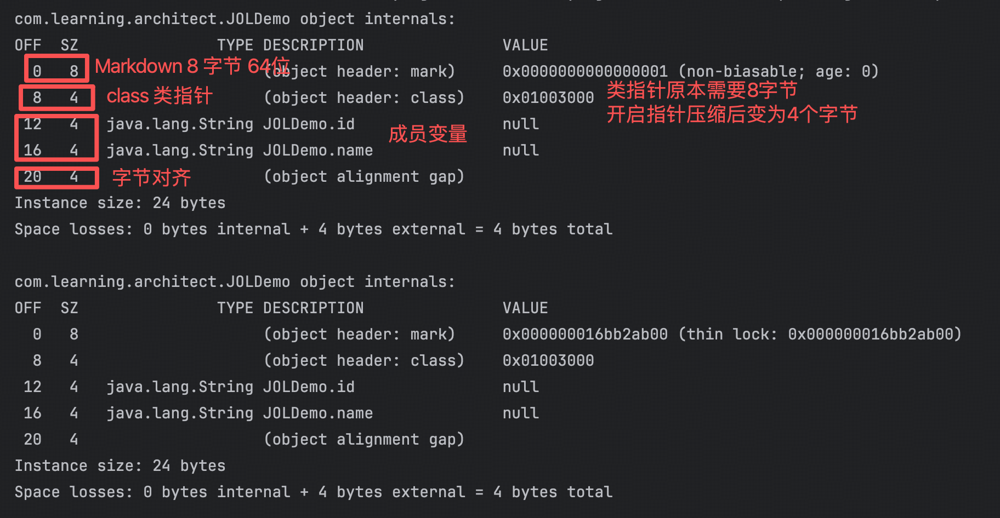

可以看到ClassPoint 实际上就是指向元空间对应类的一个指针。目前是被压缩过的。

Markdown 标志位是对象的一些状态信息，包括对象的HashCode，锁状态，GC分代年龄等。

### 4. 执行引擎

在 .class 文档中已经明确指定了代码执行顺序。而执行引擎是将这些字节码指令转变为机器指令去执行。

#### 4.1 解释执行与编译执行

JVM 中有两种执⾏的⽅式：
* 解释执⾏就相当于是同声传译。JVM 接收⼀条指令，就将这条指令翻译成机器指令执⾏。
* 编译执⾏就相当于是提前翻译。好⽐领导发⾔前就将讲话稿提前翻译成对应的⽂本，上台讲话时就可以照着念了。编译执⾏也就是传说中的 JIT 。

⼤部分情况下，使⽤编译执⾏的⽅式显然⽐解释执⾏更快，减少了翻译机器指令的性能消耗。⽽我们常⽤的 HotSpot 虚拟机，最为核⼼的实现机制就是这个 HotSpot 热点。他会搜集⽤户代码中执⾏最频繁的热点代码，形成CodeCache，放到元空间中，后续再执⾏就不⽤编译，直接执⾏就可以了。

但是编译执⾏起始也有⼀个问题，那就是程序预热会⽐较慢。毕竟作为虚拟机，你不可能提前预知到程序员要写⼀些什么稀奇古怪的代码，也就不可能把所有代码都提前编译成模板。⽽将执⾏频率并不⾼的代码也编译保存下来，也是得不偿失的。所以，现在JDK 默认采⽤的就是⼀种混合执⾏的⽅式。他会⾃⼰检测采⽤那种⽅式执⾏更快。虽然你可以⼲预 JDK 的执⾏⽅式，但是在绝⼤部分情况下，都是不需要进⾏⼲预的。

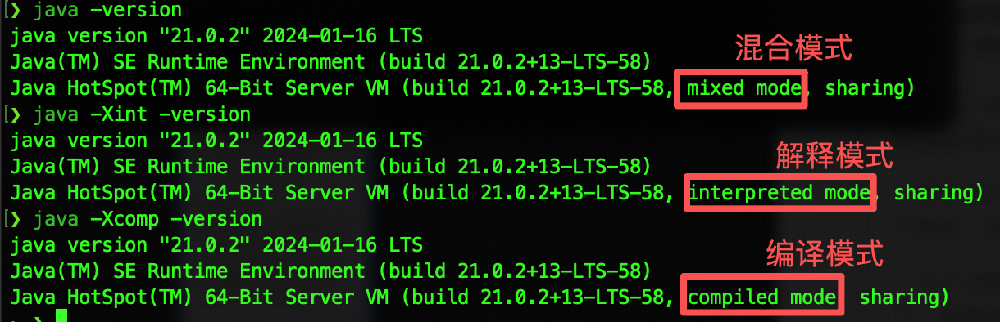

#### 4.2 编译执行时的代码优化

热点代码会触发 JIT 实时编译，⽽ JIT 编译运⽤了⼀些经典的编译优化技术来实现代码的优化，可以智能地编译出运⾏时的最优性能代码。

HotSpot虚拟机中内置了两个（或三个）即时编译器，其中有两个编译器存在已久，分别被称为“客户端编译器”（Client Compiler）和“服务端编译器”（Server Compiler），或者简称为C1编译器和C2编译器（部分资料和JDK源码中C2也叫Opto编译器），第三个是在JDK 10时才出现的、⻓期⽬标是代替C2的Graal编译器。Graal编译器采⽤ Java 语⾔编写，因此⽣态的活⼒更强。并由此衍⽣出了 GraalVM 这样的⽀持实时编译的产品。也就是绕过 Class ⽂件，直接将 Java 代码编译成可在操作系统本地执⾏的应⽤程序。这也就是 AOT 技术Ahead Of Time。

C1 会对字节码进⾏简单和可靠的优化，耗时短，以达到更快的编译速度。启动快，占⽤内存⼩，执⾏效率没有 server快。默认情况下不进⾏动态编译，适⽤于桌⾯应⽤程序。

C2 进⾏耗时较⻓的优化，以及激进优化，但优化的代码执⾏效率更⾼。启动慢，占⽤内存多，执⾏效率⾼，适⽤于服务器端应⽤。 默认情况下就是使⽤的 C2 编译器。并且，绝⼤部分情况下也不建议特意去使⽤ C1。

#### 4.3 静态执⾏与动态执⾏

静态执⾏指在 Class ⽂件编译过程中就已经确定了执⾏⽅法。 动态执⾏指需要在运⾏期间才能确定调⽤哪个⽅法。⽐如多个重载的⽅法，需要根据传⼊类型确定调⽤哪个⽅法。

动态执⾏更多的是关联到invokedynamic指令。在JVM的语⾔体系中，以Scala为代表的函数式的编程⽅式会越来越重要，到时候动态执⾏也会随之变得更为重要。

### 5. 垃圾回收

执⾏引擎会将class⽂件扔到JVM的内存当中运⾏。在运⾏过程中，需要不断的在内存当中创建并销毁对象。在传统C/C++语⾔中，这些销毁的对象需要⼿动进⾏内存回收，防⽌内存泄漏。⽽在Java当中，实现了影响深远的GC垃圾回收机制。

GC 垃圾⾃动回收，这个可以说是 JVM 最为标志性的功能。不管是做性能调优，还是⼯作⾯试，GC 都是 JVM 部分的重中之重。⽽对于 JVM 本身，GC 也是不断进⾏设计以及优化的核⼼。⼏乎 Java 提出的每个版本都对 GC 有或⼤或⼩的改动。这⾥，我就⽤⽬前还是⽤得做多的 JDK8，带⼤家快速梳理⼀下 GC 部分的主线。

#### 5.1 垃圾回收是干什么的

在了解 JVM之前，给⼤家推荐⼀个⼯具，阿⾥开源的 Arthas 。官⽹地址：https://arthas.aliyun.com/ 。 这个⼯具功能⾮常强⼤，是对 Java进程进⾏性能调优的⼀个⾮常重要的⼯具，对于了解 JVM 底层帮助也⾮常⼤。

我们先运⾏⼀个简单的 Java 程序：
```java
public class GCTest {
    public static void main(String[] args) throws InterruptedException {
        List l = new ArrayList<>();
        for(int i = 0 ; i < 100_0000 ; i ++){
            l.add(new String("aaaaa"));
            Thread.sleep(100);
        }
    }
}
```

arthas 运⾏结果：

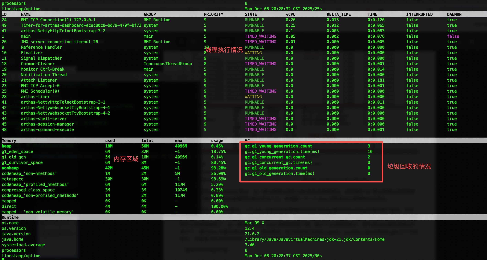

重点关注中间的 Memory 部分，这⼀部分就是记录的 JVM 的内存使⽤情况。⽽后⾯的 GC 部分就是垃圾回收的执⾏情况。我们就从这些能看到的部分作为⼊⼝，来理解⼀下⼀个 Java 进程是怎么管理他的内存的。

从 Memory 部分可以看到，⼀个 Java 进程会将他管理的内存分为heap堆区和nonheap⾮堆区两个部分。其中⾮堆区的⼏个核⼼部分像code_cache(热点指令缓存)，metaspace(元空间),compressed_class_space(压缩类空间)我们之前都接触到了。这⼀部分就相当于 Java 进程中的地下室，属于不太活跃的部分。⽽中间heap堆区就相当于客厅了，属于Java 中最为核⼼的部分。⽽这其中，⼜⼤体分为了eden_space，survivor_space和old_gen三个⼤的部分，这就是 JVM 内存的主体。我们之前分析的栈区，这⾥没有列出。

整体内存布局如下图：

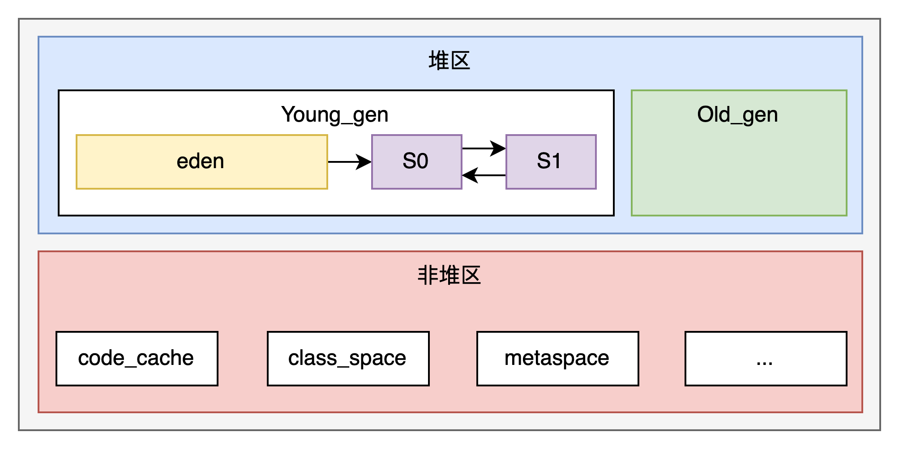

其中堆区是 JVM 核⼼的存放对象的内存区域。他的⼤⼩可以由参数 -Xms(初始堆内存⼤⼩)，-Xmx(最⼤堆内存)参数指令。从这两个参数可以看到，堆内存是可以扩展的。如果初始内存不够，JVM 会扩⼤堆内存。但是如果内存扩展到了最⼤堆内存时还不够。这时就⽆法继续扩展了，⽽是会抛出 OOM 异常。这两个参数在⽣产环境中最好设置成⼀样，减少内存扩展时的性能消耗。⽽GC垃圾回收器，就是要对这些内存空间进⾏及时回收，从⽽让这些内存可以重复利⽤。

#### 5.2 分代收集模型
JAVA做过统计，80%的对象都是“朝⽣夕死”。这些对象，被集中放在了⼀块⽐较⼩的内存空间当中，快速创建，快速回收，这块内存区域就是年轻代。在年轻代会⾮常频繁的进⾏垃圾回收，称为YoungGC。⽽年轻代⼜会被进⼀步划分为⼀个eden_space和两个survivor。这三个区域的⼤⼩⽐例默认是 8:1:1。

另外少部分需要⻓期使⽤的对象，被放到另⼀块竞争没有那么激烈的对象，则被放到另外⼀块⽐较⼤的内存空间当中，⻓期保持，这块内存就是⽼年代。在⽼年代，垃圾回收的频率则会相对⽐较低，只有空间不够时才进⾏，称为OldGC。

年轻代与⽼年代默认的⼤⼩⽐例是 1:2。

常⻅的分代收集模型中，对象会优先在eden区创建，经过⼀次YoungGC后，如果没有被回收，就会被移动到⼀个survivor区。接下来，下⼀次YoungGC时，⼜会被移动到另⼀块Survivor区。每移动⼀次，记录⼀个分代年龄。直到分代年龄太⼤了(默认是16)，就会被移动到⽼年代。到⽼年代后，对象就不再记录分代年龄了，在⽼年代安安静静的⽤到退休。

这就是JDK最有代表性的分代年龄收集机制。通过分代收集机制，JVM可以对不同的对象采取不同的回收策略，从⽽提⾼垃圾回收的效率。

#### 5.3 JVM中有哪些垃圾回收器？

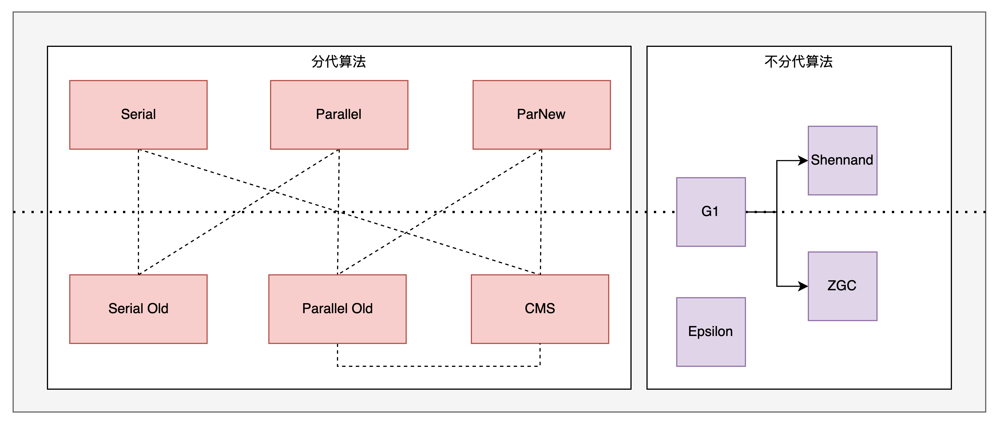

其中，左边的都是分代算法。也就是将内存划分为年轻代和⽼年代进⾏管理。⽽有虚线的部分表示可以协同进⾏⼯作。JDK8默认就是使⽤的Parallel Scavenge和Parallel Old的组合。也就是在arthas的dashboard中看到的ps。右侧的是不分代算法。也就是不再将内存严格划分位年轻代和⽼年代。JDK9 开始默认使⽤ G1。⽽ ZGC是⽬前最先进的垃圾回收器。shennandoah则是OpenJDK 中引⼊的新⼀代垃圾回收器，与 ZGC 是竞品关系。Epsilon是⼀个测试⽤的垃圾回收器，根本不⼲活。

### 6. GC 情况分析实例

#### 6.1 如何定制GC运⾏参数

关于 JVM 的参数，JVM 提供了三类参数：
* 标准参数，以-开头，所有 HotSpot 都⽀持。例如java -version。这类参数可以使⽤java -help 或者java -? 全部打印出来
* ⾮标准参数，以-X 开头，是特定 HotSpot版本⽀持的指令。例如java -Xms200M -Xmx200M。这类指令可以⽤java -X 全部打印出来。
* 不稳定参数，这也是 JVM调优的噩梦。以-XX 开头，这些参数是跟特定HotSpot版本对应的，很有可能换个版本就没有了。详细的⽂档资料也特别少。JDK8 中的以下⼏个指令可以帮助开发者了解 JDK8 中的这⼀类不稳定参数。

```
java -XX:+PrintFlagsFinal:所有最终⽣效的不稳定指令。
java -XX:+PrintFlagsInitial:默认的不稳定指令
java -XX:+PrintCommandLineFlags:当前命令的不稳定指令 --这⾥可以看到是⽤的哪种GC。 JDK1.8默认⽤的ParallelGC
```

#### 6.2 打印GC⽇志

* -XX:+PrintGC: 打印GC信息 类似于-verbose:gc
* -XX:+PrintGCDetails: 打印GC详细信息，这⾥主要是⽤来观察FGC的频率以及内存清理效率。
* -XX:+PrintGCTimeStamps 配合 -XX:+PrintGC使⽤。在 GC 中打印时间戳。
* -XX:PrintHeapAtGC: 打印GC前后的堆栈信息
* -Xloggc:filename : GC⽇志打印⽂件。

> 不同 JDK 版本会有不同的参数。 ⽐如 JDK9 中，就不⽤分这么多参数了，可以统⼀使⽤-X-log:gc* 通配符打印所有的 GC ⽇志。

示例：

```java
public class GcLogTest {
    public static void main(String[] args) {
        ArrayList<byte[]> list = new ArrayList<>();

        for (int i = 0; i < 500; i++) {
            byte[] arr = new byte[1024 * 100];//100KB
            list.add(arr);
            try {
                Thread.sleep(10);
            } catch (InterruptedException e) {
                e.printStackTrace();
            }
        }
    }
}
```

然后在执⾏这个⽅法时，添加以下 JVM 参数：

```
-Xms60m -Xmx60m -XX:SurvivorRatio=8 -XX:+PrintGCDetails
```

如下图所示：

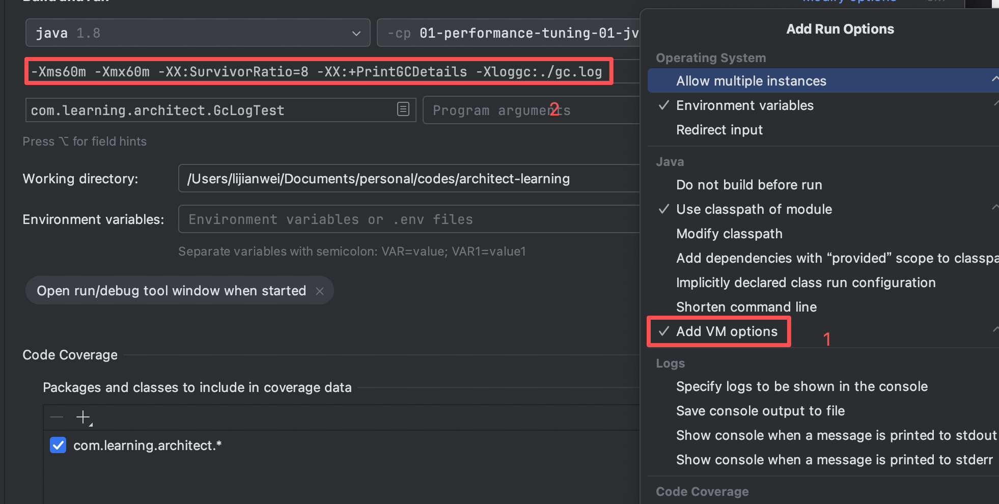

执行代码，看到如下结果：

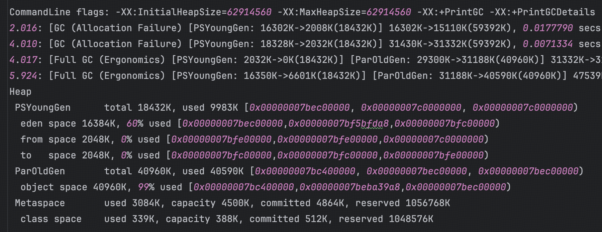

这⾥⾯就记录了两次 MinorGC 和两次 FullGC 的执⾏效果。另外，在程序执⾏完成后，也会打印出 Heap 堆区的内存使⽤情况。

当然，⽬前这些⽇志信息只是打印在控制台，你只能凭经验⾃⼰强⾏去看。接下来，就可以添加-Xloggc参数，将⽇志打印到⽂件⾥。然后拿⽇志⽂件进⾏整体分析。

#### 6.3 ⽇志分析

这⾥推荐⼀个开源⽹站 https://www.gceasy.io/ 这是国外⼀个开源的GC ⽇志分析⽹站。你可以把 GC ⽇志⽂件直接上传到这个⽹站上，他就会分析出⽇志⽂件中的详细情况。

### 面试题

1. JVM 是什么，由什么组成？    
   A：JVM 是 Java 虚拟机，是用来运行 Java 代码的，组成：两个子系统（类加载、执行引擎）和两个组件（运行时数据区、本地方法库）。
2. Java 程序在 JVM 的整个声明周期内都干了什么?
   1. 加载 -> 验证 -> 准备 -> 解析 -> 初始化 -> 使用 -> 卸载
3. class 文件是如何保证安全的？ 
   A: class 文件验证
4. Java 当中的静态⽅法可以被⼦类重写吗？
   A: 不能，因为在 JVM 中，调⽤⽅法提供了⼏个不同的字节码指令。invokcvirtual 调⽤对象的虚⽅法(**也就是可被⼦类重写的这些⽅法**)。invokespecial 根据编译时类型来调⽤实例⽅法，⽐如静态代码块(通常对应字节码层⾯的cinit ⽅法)，构造⽅法(通常对应字节码层⾯的init⽅法)。invokestatic 调⽤类（静态）⽅法。 invokcinterface 调⽤接⼝⽅法。静态⽅法和可重写的⽅法他们的调⽤指令都是不⼀样的，那么肯定是⽆法重写静态⽅法的。
5. 