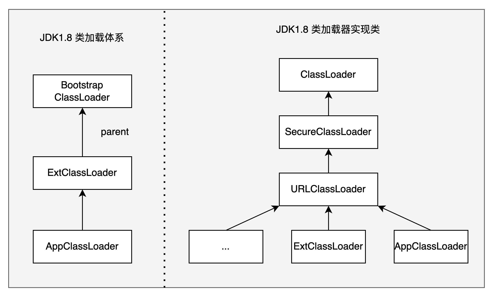
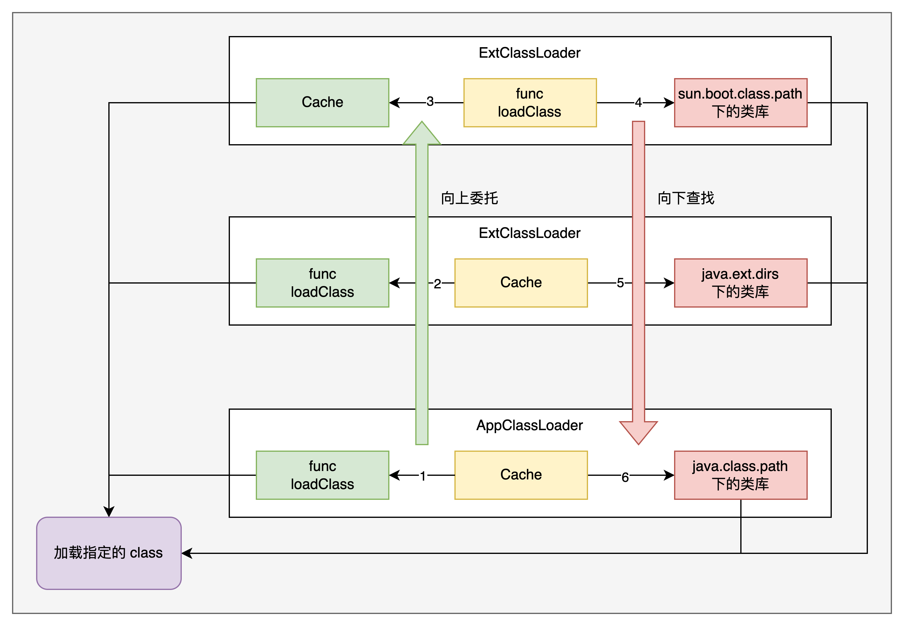
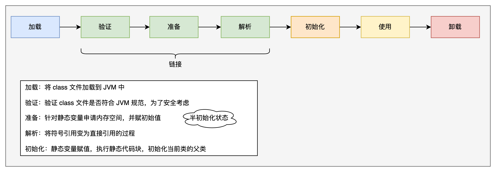
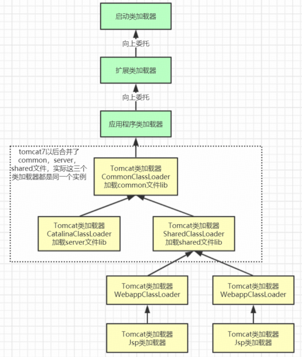

## Java 类加载

[TOC]

### 1.Java 类加载机制

三句话总结 JDK1.8 类加载机制：
* 每个类加载器对加载过的类都会维护一个缓存
* 双亲委派机制：向上委托查找，向下委托加载。
* 沙箱安全机制：不允许应⽤程序加载JDK内部的系统类。

#### 1.1 JDK 1.8 类加载体系

```java
public class LoaderDemo {
    public static String a ="aaa";
    public static void main(String[] args) throws ClassNotFoundException {
        // 父子关系 AppClassLoader <- ExtClassLoader <- BootStrap Classloader
        ClassLoader cl1 = LoaderDemo.class.getClassLoader();
        System.out.println("cl1 > " + cl1);
        System.out.println("parent of cl1 > " + cl1.getParent());
        // BootStrap Classloader由C++开发，是JVM虚拟机的一部分，本身不是JAVA类。
        System.out.println("grant parent of cl1 > " + cl1.getParent().getParent());
        // String,Int等基础类由BootStrap Classloader加载。
        ClassLoader cl2 = String.class.getClassLoader();
        System.out.println("cl2 > " + cl2);
        System.out.println(cl1.loadClass("java.util.List").getClass().getClassLoader());

        // java指令可以通过增加-verbose:class -verbose:gc 参数在启动时打印出类加载情况
        // BootStrap Classloader，加载java基础类。这个属性不能在java指令中指定，推断不是由java语言处理。。
        System.out.println("BootStrap ClassLoader加载目录：" + System.getProperty("sun.boot.class.path"));
        // Extention Classloader 加载JAVA_HOME/ext下的jar包。 可通过-D java.ext.dirs另行指定目录
        System.out.println("Extention ClassLoader加载目录：" + System.getProperty("java.ext.dirs"));
        // AppClassLoader 加载CLASSPATH，应用下的Jar包。可通过-D java.class.path另行指定目录
        System.out.println("AppClassLoader加载目录：" + System.getProperty("java.class.path"));
    }
}
```



左侧是JDK中实现的类加载器，通过parent属性形成⽗⼦关系。应⽤中⾃定义的类加载器的parent都是 AppClassLoader。

右侧是JDK中的类加载器实现类。通过类继承的机制形成体系。未来我们就可以通过继承相关的类实现⾃定义类加载器。

> 简⽽⾔之，左侧是对象，右侧是类。

JDK8中的类加载器都继承于⼀个统⼀的抽象类ClassLoader，类加载的核⼼也在这个⽗类中。其中，加载类的核⼼⽅法如下：
```java
protected Class<?> loadClass(String name, boolean resolve)
    throws ClassNotFoundException
{
    synchronized (getClassLoadingLock(name)) {
        // 首先，查找是否类已经被加载过（每个类加载器对加载过的类维护了一个缓存）
        Class<?> c = findLoadedClass(name);
        if (c == null) {
            long t0 = System.nanoTime();
            try {
                if (parent != null) {
                    // 若有父类加载，则优先调用父类加载器进行加载
                    c = parent.loadClass(name, false);
                } else {
                    // 无父类，说明是顶级类加载器，则使用 Bootstrap ClassLoader 加载
                    c = findBootstrapClassOrNull(name);
                }
            } catch (ClassNotFoundException e) {
                // ClassNotFoundException thrown if class not found
                // from the non-null parent class loader
            }

            if (c == null) {
                // If still not found, then invoke findClass in order
                // to find the class.
                long t1 = System.nanoTime();
                // 父类加载器加载失败，则调用当前类加载器进行加载
                c = findClass(name);

                // this is the defining class loader; record the stats
                PerfCounter.getParentDelegationTime().addTime(t1 - t0);
                PerfCounter.getFindClassTime().addElapsedTimeFrom(t1);
                PerfCounter.getFindClasses().increment();
            }
        }
        // 运行时加载类，默认不进行链接步骤
        if (resolve) {
            // 这一段是类加载过程中的链接阶段，分为三个步骤：验证、准备、解析
            resolveClass(c);
        }
        return c;
    }
}
```

> PS：该方法是 protected 的，所以子类可以重写该方法，打破双亲委派！

当⼀个类加载器要加载⼀个类时，整体的过程就是通过双亲委派机制向上委托查找，如果没有查找到，就向下委托加载。整个过程整理如下图：



#### 1.2 沙箱安全机制

双亲委派机制有⼀个最⼤的作⽤就是要保护JDK内部的核⼼类不会被应⽤覆盖。⽽为了保护JDK内部的核⼼类，JAVA在双亲委派的基础上，还加了⼀层保险。就是ClassLoader中的下⾯这个⽅法。

```java
private ProtectionDomain preDefineClass(String name,
                                            ProtectionDomain pd)
{
  if (!checkName(name))
      throw new NoClassDefFoundError("IllegalName: " + name);

  // 不允许加载核心类
  if ((name != null) && name.startsWith("java.")
          && this != getBuiltinPlatformClassLoader()) {
      throw new SecurityException
          ("Prohibited package name: " +
           name.substring(0, name.lastIndexOf('.')));
  }
  if (pd == null) {
      pd = defaultDomain;
  }

  if (name != null) {
      checkCerts(name, pd.getCodeSource());
  }

  return pd;
}
```

这个方法会用在Java在内部定义一个类之前。不允许加载 java 包下的类。

### 2. Linking 链接过程

在ClassLoader的loadClass⽅法中，还有⼀个不起眼的步骤，resolveClass。这是⼀个native⽅法。⽽其实现的过程称为linking-链接。链接过程的实现功能如下图：



其中关于半初始化状态就是JDK在处理⼀个类的static静态属性时，会先给这个属性分配⼀个默认值，作⽤是占住内存。然后等连接过程完成后，在后⾯的初始化阶段，再将静态属性从默认值修改为指定的初始值。

例如参照⼀下下⾯这个案例：
```java
class Apple {
    static Apple apple = new Apple(10);
    static double price = 20.00;
    double totalpay;

    public Apple(double discount) {
        System.out.println("====" + price);
        totalpay = price - discount;
    }
}

public class PriceTest01 {

    public static void main(String[] args) {
        System.out.println(Apple.apple.totalpay);
    }
}
```

程序打印出的结果是-10 ，⽽不是10。 这感觉有点反直觉，为什么呢？就是因为这个半初始化状态。

其中Apple.apple访问了类的静态变量，会触发类的初始化，即加载 -> 链接 -> 初始化

整个的执行过程：
1. main 函数访问 Apple.apple
2. 开始执行：static Apple apple = new Apple(10);
3. 由于 static double price = 20.00; 在 static Apple apple = new Apple(10); 之后，所以在 new Apple(10); 的时候，price 还是在准备阶段，默认值 0.0
4. 因此打印的是 0 和 -10。

> 思考问题： 如何让结果打印出正常的10呢？
> 给 price 加个 final 关键字 或 将 price 移动到 apple 之前赋值。

如果A类中有⼀个静态属性，引⽤了另⼀个B类。那么在对类进⾏初始化的过程中，因为A和B这两个类都没有初始化，JVM并不知道A和B这两个类的具体地址。所以这时，在A类中，只能创建⼀个不知道具体地址的引⽤，指向B类。这个引⽤就称为符号引⽤。⽽当A类和B类都完成初始化后，JVM⾃然就需要将这个符号引⽤转⽽指向B类具体的内存地址，这个引⽤就称为直接引⽤。

### 2. ⼀个⽤类加载机制加薪的故事

故事背景：模拟⼀个OA系统，每个⽉需要定时计算⼤家的⼯资。

```java
public class OADemo1 {
    public static void main(String[] args) throws InterruptedException {
        Double salary = 15000.00;
        Double money = 0.00;
        //模拟不停机状态
        while (true) {
            try {
                money = calSalary(salary);
                System.out.println("实际到手Money:" + money);
            }catch(Exception e) {
                System.out.println("加载出现异常 ："+e.getMessage());
            }
            Thread.sleep(5000);
        }
    }

    private static Double calSalary(Double salary) {
		SalaryCaler caler = new SalaryCaler();
		return caler.cal(salary);
    }

}
```

⽽具体计算⼯资的⽅法，根据⾯向对象的设计思想，会交由⼀个单独的SalaryCaler类来处理
```java
public class SalaryCaler {

    public Double cal(Double salary) {
        return salary;
    }
}
```

这时，⼀个程序员⽼王，想要给⼤家都偷偷加⼀点⼯资，于是他想到的⽅法是直接修改OA系统中计算⼯资的⽅法，给⼤家都加点⼯资。

```java
public class SalaryCaler {

    public Double cal(Double salary) {
        return salary * 1.4;
    }
}
```

⽼王偷偷给⼤家加了⼯资，但是，经理肯定是不会同意的。于是，程序员与资本家的⼀个⽃智⽃勇的故事，拉开了序幕。

### 3. 通过类加载器引⼊外部Jar包

计算⼯资的⽅法都在OA系统⾥，经理直接在代码仓库就能看到。于是⽼王就要开始思考，如何让经理看不到OA系统中计算⼯资的源码。

基础的思路是将计算⼯资的⽅法，从OA系统中抽出来，放到另外⼀个jar包中。然后，就希望OA系统能够从这个jar包中读取SalaryCaler类，这样就可以绕开经理的视线了。

于是，就可以基于JDK提供的URLClassLoader，从jar包当中加载计算类

```java
public class OADemo2 {
    public static void main(String[] args) throws InterruptedException, MalformedURLException {
        Double salary = 15000.00;
        Double money = 0.00;

        ClassLoader cl = new URLClassLoader(new URL[]{new URL("file:/Users/lijianwei/Documents/personal/codes/architect-learning/salary-caler/target/salary-caler-1.0-SNAPSHOT.jar")});

        //模拟不停机状态
        while (true) {
            try {
                money = calSalary(salary,  cl);
                System.out.println("实际到手Money:" + money);
            }catch(Exception e) {
                System.out.println("加载出现异常 ："+e.getMessage());
            }
            Thread.sleep(5000);
        }
    }

    private static Double calSalary(Double salary, ClassLoader cl)
        throws NoSuchMethodException, InvocationTargetException, IllegalAccessException,
        InstantiationException, ClassNotFoundException {
		Class<?> clazz = cl.loadClass("com.learning.architect.oa.SalaryCaler");
        if (clazz != null ) {
            Object obj = clazz.newInstance();
            return (Double) clazz.getMethod("cal", Double.class).invoke(obj, salary);
        }
		return -1.00;
    }
}
```
<span id="load_seq">

>PS: 需要将项目中的 SalaryCaler.java 删除，否则按照双亲委派机制，会优先加载本项目中的 SalaryCaler 类，原因是：
> 1. URLClassLoader 初始化会先执行 super() 方法执行父类初始化，父类为 SecureClassLoader
> 2. SecureClassLoader 初始化时会先执行 super() 方法执行父类初始化，父类为 ClassLoader
> 3. ClassLoader 的初始化会执行 `this(checkCreateClassLoader()`, getSystemClassLoader());，其中 getSystemClassLoader 返回的是 AppClassLoader，而 AppClassLoader 加载的是项目中的类，加载完成之后放入缓存中，在执行 loadClass 方法的时候会从缓存中取出该类
> 4. 因此若是项目中有同名的类，那么会优先加载项目类，而不是外部类。 

</span>
拓展思考： 在真实项⽬中，这个思路有什么⽤呢？

1. 哪些jar包适合放到外部加载？
    
   那些流程⽐较统⼀，但是具体实现规则容易经常产⽣变化的场景。例如：规则引擎、统⼀审批规则、订单状态规则.....

2. 外部jar包可以放到哪些地⽅？ 
   
   URLClassLoader可以定义URL从远程Web服务器加载Jar包。 
      
   drools规则引擎实现了从maven仓库远程加载核⼼规则⽂件。

### 4. ⾃定义类加载器实现Class代码混淆

虽然经理在OA系统⾥看不到SalaryCaler类的源码了，但是通过OA系统的源码最终还是可以找到这个jar包。那么就可以对jar包进⾏反编译，查看到jar包对应的源码了。所以，⽼王还需要考虑如何对class⽂件进⾏代码混淆，让经理⽆法反编译出源码。

解决的思路有两个：

1. 简单⼀点的，将class⽂件的后缀改⼀下，从.class转为.myclass。就像⼤家把游戏软件改成.txt结尾⼀样。
2. 只是修改后缀，那么经理还可以把后缀改回来再反编译。所以稳妥⼀点的⽅法，是要改⼀改class⽂件当中的⼆进制内容。

JDK只能加载标准的class⽂件，所以，这⼀类反常规的思路，JDK就没办法提供帮助了，这时，就需要⽤⾃定义的类加载器来解决了。

> 关于如何实现⾃定义类加载器，可以查看ClassLoader类开头的注释。⾥⾯介绍了如何实现⼀个NetWorkClassLoader。

于是，⽼王就可以先定义⼀个⾃定义类加载器，实现从.myclass⽂件中加载类。

```java
public class SalaryClassLoader extends SecureClassLoader {

    private String classPath;

    public SalaryClassLoader(String classPath) {
        this.classPath = classPath;
    }

    @Override
    protected Class<?> findClass(String name) throws ClassNotFoundException {
        byte[] b = loadClassData(name);
        return defineClass(name, b, 0, b.length);
    }

    private byte[] loadClassData(String name) {
        // 查找 myclass 文件
        String filePath = classPath + name.replace(".", "/") + ".myclass";
        try {
            int code;
            FileInputStream fis = new FileInputStream(filePath);
            ByteArrayOutputStream baos = new ByteArrayOutputStream();
//            fis.read(); // 先读取一个二进制码
            while ((code = fis.read()) != -1) {
                baos.write(code);
            }
            // 将 baos 转成 bytes 数组
            return baos.toByteArray();
        } catch (IOException e) {
            throw new RuntimeException(e);
        }
    }
}
```

然后，在OA系统中通过这个⾃定义类加载器加载计算⼯资的SalaryCaler类。

```java
public class OADemo3 {
    public static void main(String[] args) throws InterruptedException, MalformedURLException {
        Double salary = 15000.00;
        Double money = 0.00;

        SalaryClassLoader salaryClassLoader = new SalaryClassLoader(
            "/Users/lijianwei/Documents/personal/codes/architect-learning/salary-caler/target/classes/");

        //模拟不停机状态
        while (true) {
            try {
                money = calSalary(salary, salaryClassLoader);
                System.out.println("实际到手Money:" + money);
            } catch (Exception e) {
                System.out.println("加载出现异常 ：" + e.getMessage());
            }
            Thread.sleep(5000);
        }
    }

    private static Double calSalary(Double salary, ClassLoader cl)
        throws NoSuchMethodException, InvocationTargetException, IllegalAccessException,
        InstantiationException, ClassNotFoundException {
        Class<?> clazz = cl.loadClass("com.learning.architect.oa.SalaryCaler");
        if (clazz != null) {
            Object obj = clazz.newInstance();
            return (Double) clazz.getMethod("cal", Double.class).invoke(obj, salary);
        }
        return -1.00;
    }

}
```

> 这个示例中没有修改类的二进制内容，只是修改了类⽂件的后缀。可以在二进制文件中加一个二进制码，然后将类加载器中注释的 `fis.read();` 放开。在二进制文件中加一个二进制码代码如下：

```java
public class FileTransferTest {

    public static void main(String[] args) {
        try {
            FileInputStream fis = new FileInputStream("/Users/lijianwei/Documents/personal/codes/architect-learning/salary-caler/target/classes/com/learning/architect/oa/SalaryCaler.class");
            FileOutputStream fos = new FileOutputStream("/Users/lijianwei/Documents/personal/codes/architect-learning/salary-caler/target/classes/com/learning/architect/oa/SalaryCaler.myclass");
            fos.write(1);
            int code;
            while ((code = fis.read()) != -1) {
                fos.write(code);
            }
        } catch (IOException e) {
            throw new RuntimeException(e);
        }

    }
}
```

拓展思考：

1. 如何进⼀步提升关键代码的安全性？

   我们这个算法太简单了，经理看看类加载器的源码就知道，只要把.myclass⽂件前⾯的1去掉，就能拿到原来的class⽂件内容，从⽽进⾏反编译。有没有什么算法，可以让经理推导不出原始的class⽂件内容呢？

   常⽤的加密算法就派上⽤场了。MD5、对称加密、⾮对称加密...

   或者是不是能够有更多奇怪的思路，⽐如将类加载器的class⽂件也加密呢？通过⾃定义类加载器A，从⼀个加密class⽂件当中加载出⼀个类加载器B，再⽤后⾯这个类加载器B，加载加密过的核⼼代码。

2. 如何在真实项⽬中⽤上这种机制？

   真实项⽬当中不会拿class⽂件直接部署，都是拿jar包进⾏部署。所以，我们要做的是，在⾃定义类加载器中，将从硬盘上读取class⽂件的实现⽅式，改为从jar包当中读取class⽂件。这个通过⽂件流照样很容易实现。
   
   若是想得到带 myclass 的 jar 包可以先使用 maven 的 compile 命令，然后执行 [FileTransferTest.java](../salary-caler/src/main/java/com/learning/architect/oa/FileTransferTest.java)，然后使用 maven 的 package 命令，将编译后的包打成 jar 包。   

```java
public class SalaryJARLoader extends SecureClassLoader {

    private final String jarPath;

    public SalaryJARLoader(String jarPath) {
        this.jarPath = jarPath;
    }

    @Override
    protected Class<?> findClass(String name) throws ClassNotFoundException {
        byte[] b = loadClassData(name);
        return defineClass(name, b, 0, b.length);
    }

    private byte[] loadClassData(String name) {
        String classFilePath = name.replace(".", "/").concat(".myclass");
        System.out.println("classFilePath:" + classFilePath);
        try {
            int code;
            URL jarFile = new URL("jar:file:" + jarPath + "!/" + classFilePath);
            URLConnection urlConnection = jarFile.openConnection();
            // 不使用缓存 不然有些操作系统下会出现jar包无法更新的情况
            urlConnection.setUseCaches(false);
            InputStream is = urlConnection.getInputStream();
            ByteArrayOutputStream baos = new ByteArrayOutputStream();
            is.read(); // 先读取一个二进制码
            while ((code = is.read()) != -1) {
                baos.write(code);
            }
            // 将 baos 转成 bytes 数组
            return baos.toByteArray();
        } catch (IOException e) {
            throw new RuntimeException(e);
        }
    }
}
```

### 5. ⾃定义类加载器实现热加载

⽼王通过重重考验，终于瞒过了经理。但是这时⼜遇到⼀个头疼的情况。总公司需要时不时的核算⼯资，⽼王⾃然想要在总公司核算⼯资之前将计算⼯资的⽅式改回去，避免露馅。然后等总公司核算完成了再改回来。

既然SalaryCaler类都是从jar包当中修改的，那么是不是直接修改jar包就可以了呢？很可惜，⽼王经过测试后，结果并不是那么令⼈满意。每次修改jar包后，都需要重启OA系统才能⽣效。总公司每次来核查⼯资就要重启⼀次OA系统，这样岂不是此地⽆银三百两了？

其实深⼊分析就很容易找到愿意。SalaryCaler类⽆法及时更新的根本原因就在于SalaryJARLoader对他加载过的类都保存了⼀个缓存。只要这个缓存存在，SalaryClassLoader就不会去jar包中加载，⽽是从缓存当中加载。⽽这个缓存是在JVM层⾯实现的，JAVA代码接触不到这个缓存，所以解决的思路⾃然就只能简单粗暴的连这个SalaryJARLoader也⼀起重新创建⼀个了。

```java
public class OADemo5 {
    public static void main(String[] args) throws InterruptedException, MalformedURLException {
        Double salary = 15000.00;
        Double money = 0.00;
        //模拟不停机状态
        while (true) {
            try {
                money = calSalary(salary);
                System.out.println("实际到手Money:" + money);
            } catch (Exception e) {
                System.out.println("加载出现异常 ：" + e.getMessage());
            }
            Thread.sleep(5000);
        }
    }

    private static Double calSalary(Double salary)
        throws NoSuchMethodException, InvocationTargetException, IllegalAccessException,
        InstantiationException, ClassNotFoundException {
        SalaryJARLoader cl = new SalaryJARLoader(
            "/Users/lijianwei/Documents/personal/codes/architect-learning/salary-caler/target/salary-caler-1.0-SNAPSHOT.jar");
        Class<?> clazz = cl.loadClass("com.learning.architect.oa.SalaryCaler");
        if (clazz != null) {
            Object obj = clazz.newInstance();
            return (Double) clazz.getMethod("cal", Double.class).invoke(obj, salary);
        }
        return -1.00;
    }

}
```

通过这种⽅式，每次都是创建出⼀个新的SalaryJARLoader对象，那么他的缓存肯定是空的。那么他⾃然就只能每次都从jar包当中加载类了。于是，⽼王可以愉快的随时切换jar包，实现热更新了。

拓展思考：

1. 这个热加载机制看似很好⽤，为什么在开源项⽬中没有⻅过这种⽤法？

   很显然，这种热加载机制需要创建出⾮常多的ClassLoader对象。⽽这些不⽤的ClassLoader对象加载过的缓存对象也会随之成为垃圾。这会让JVM中本来就不⼤的元数据区带来很⼤的压⼒，极⼤的增加GC线程的压⼒。

   但是在项⽬开发时，其实是有⼀些办法可以实现这种类似的热更新机制。例如IDEA中的JRebel插件，还有之前介绍过的Arthas。

2. 加载SalaryCaler的时候真的只加载⼀个类吗？

   把SalaryJARLoader加载过的类打印出来，你会发现，在加载SalaryCaler时，其实不光加载了这个类，同时还加载了Double和Object两个类。这两个类哪⾥来的？这就是JVM实现的懒加载机制。

   JVM为了提⾼类加载的速度，并不是在启动时直接把进程当中所有的类⼀次加载完成，⽽是在⽤到的时候才去加载。也就是懒加载。

### 6. 打破双亲委派，实现同类多版本共存

就在⽼王跟资本家们⽃得不亦乐乎的时候，另⼀个新⼿程序员⼩王突然给⽼王来了个背刺。不知道什么原因，⼩王突然在OA系统当中也提交了个SalaryCaler类。这时⽼王突然发现，这个看似没⽤的SalaryCaler类却突然导致刚刚还挺得意的热加载机制失效了。不管jar包如何更新，OA系统总是只加载⼩王提交的那个SalaryCaler类。

为什么会出现这种情况呢？这就是因为JDK的双亲委派机制。

⾃定的SalaryJARLoader的parent属性指向的是JDK内的AppClassLoader。⽽AppClassLoader会加载OA系统当中的所有代码，当然就包括⼩王提交的SalaryCaler类。这时，SalaryJARLoader去加载SalaryCaler类时，通过双亲委派，⾃然加载出来的就是APPClassloader中的SalayCaler了。详细的加载流程可以看下 [3. 通过类加载器引⼊外部Jar包 PS 部分](#load_seq)

所以，要保持热加载机制不失效，那就只能对这个双亲委派机制下⼿了。

下⼿的逻辑也很简单，我们只需要让这个SalaryCaler类优先从jar包中加载就可以了。

```java
public class SalaryJARLoader6 extends SecureClassLoader {

    private final String jarPath;

    public SalaryJARLoader6(String jarPath) {
        this.jarPath = jarPath;
    }

    @Override
    protected Class<?> loadClass(String name, boolean resolve) throws ClassNotFoundException {
        // 报错 java.io.FileNotFoundException: JAR entry java/lang/Object.myclass
        if (!name.startsWith("com.learning.architect.oa")) {
            return super.loadClass(name, resolve);
        }
        
        synchronized (getClassLoadingLock(name)) {
            // First, check if the class has already been loaded
            Class<?> c = findLoadedClass(name);
            if (c == null) {
                c = findClass(name);
                if (c == null) {
                    c = super.loadClass(name);
                }
            }
            return c;
        }
    }

    @Override
    protected Class<?> findClass(String name) throws ClassNotFoundException {
        byte[] b = loadClassData(name);
        return defineClass(name, b, 0, b.length);
    }

    private byte[] loadClassData(String name) {
        String classFilePath = name.replace(".", "/").concat(".myclass");
        System.out.println("classFilePath:" + classFilePath);
        try {
            int code;
            URL jarFile = new URL("jar:file:" + jarPath + "!/" + classFilePath);
            URLConnection urlConnection = jarFile.openConnection();
            // 不使用缓存 不然有些操作系统下会出现jar包无法更新的情况
            urlConnection.setUseCaches(false);
            InputStream is = urlConnection.getInputStream();
            ByteArrayOutputStream baos = new ByteArrayOutputStream();
            is.read(); // 先读取一个二进制码
            while ((code = is.read()) != -1) {
                baos.write(code);
            }
            // 将 baos 转成 bytes 数组
            return baos.toByteArray();
        } catch (IOException e) {
            throw new RuntimeException(e);
        }
    }
}
```

拓展思考:

1. 我们可以通过打破双亲委派绕过JDK的沙箱保护机制吗？

   显然不能。因为JDK内部的三个类加载器示例的实现是改不了的。只要这三个类加载器的加载改不了，那么JDK中那些核⼼的类就还是安全的。

   其实，这个问题也可以延伸到JDK8往后的版本当中。从JDK9开始，JDK中引⼊了模块化机制，⽽内部的类加载器实现也随之做了翻天覆地的改变。每个类加载器不再是单独负责⼀个⼯作⽬录，⽽是改为分⼯负责⼀部分的模块。但是，对于⾃定义类加载器，JDK还是保留了原有的双亲委派机制。在之后带⼤家分析JDK17的类加载机制时会看到，虽然JDK17内部的加载机制发⽣了变化，但是我们这些案例，⼏乎都可以平滑的转移过去。

2. 在真实项⽬中，有什么样的业务场景需要打破双亲委派呢？

   双亲委派机制是⾮常基础的⼀个底层体系，很多重要框架都需要进⾏定制。

   例如Tomcat的类加载体系如下：
   
   

   tomcat的⼏个主要类加载器：
   
   * commonLoader：Tomcat最基本的类加载器，加载路径中的class可以被Tomcat容器本身以及各个Webapp访问； 
   * catalinaLoader：Tomcat容器私有的类加载器，加载路径中的class对于Webapp不可⻅； 
   * sharedLoader：各个Webapp共享的类加载器，加载路径中的class对于所有Webapp可⻅，但是对于Tomcat容器不可⻅；
   * WebappClassLoader：各个Webapp私有的类加载器，加载路径中的class只对当前Webapp可⻅，⽐如加载war包⾥相关的类，每个war包应⽤都有⾃⼰的WebappClassLoader，实现相互隔离，⽐如不同war包应⽤引⼊了不同的spring版本，这样实现就能加载各⾃的spring版本；
   * Jsp类加载器：针对每个JSP⻚⾯创建⼀个加载器。这个加载器⽐较轻量级，所以Tomcat还实现了热加载，也就是JSP只要修改了，就创建⼀个新的加载器，从⽽实现了JSP⻚⾯的热更新。

### 7. 使⽤类加载器能不能不⽤反射？

对于⼀般程序员，故事到这也就结束了。接下来的部分，就属于有追求的程序员，继续打磨技术追求真理的过程了。

⽼王分析了热加载器失效的原因，其实就是因为在OA应⽤的多个类加载器中，同时存在了SalaryCaler类的多个版本。

AppClassLoader中的SalaryCaler对象，可以直接new出来，但是SalaryJARLoader中的那个SalaryCaler对象，在之前的例⼦当中，都只能通过很别扭的反射来使⽤。同样都是SalaryCaler，就不能让他也像⼀个正常的类那样使⽤吗？

于是，⽼王想到了⼀个简单粗暴的⽅式，明明都是SalaryCaler对象，那是不是可以直接做类型转换呢？像这样

```java
public class OADemo7 {
    public static void main(String[] args) throws InterruptedException, MalformedURLException {
        Double salary = 15000.00;
        Double money = 0.00;
        //模拟不停机状态
        while (true) {
            try {
                money = calSalary(salary);
                System.out.println("实际到手Money:" + money);
            } catch (Exception e) {
                System.out.println("加载出现异常 ：" + e.getMessage());
            }
            Thread.sleep(5000);
        }
    }

    private static Double calSalary(Double salary)
        throws NoSuchMethodException, InvocationTargetException, IllegalAccessException,
        InstantiationException, ClassNotFoundException {
        // SalaryJARLoader 会优先加载项目中的 SalaryCaler
//        SalaryJARLoader cl = new SalaryJARLoader(
//            "/Users/lijianwei/Documents/personal/codes/architect-learning/salary-caler/target/salary-caler-1.0-SNAPSHOT.jar");
        SalaryJARLoader6 cl = new SalaryJARLoader6(
            "/Users/lijianwei/Documents/personal/codes/architect-learning/salary-caler/target/salary-caler-1.0-SNAPSHOT.jar");
        Class<?> clazz = cl.loadClass("com.learning.architect.oa.SalaryCaler");
        if (clazz != null) {
            SalaryCaler salaryCaler = (SalaryCaler)clazz.newInstance();
            return salaryCaler.cal(salary);
        }
        return -1.00;
    }

}
```

理想很美好，现实很⻣感。这样强⾏的类型转换，只会得到⼀个让⼈怀疑⼈⽣的异常：
```
加载出现异常 ：com.learning.architect.oa.SalaryCaler cannot be cast to com.learning.architect.oa.SalaryCaler
```

是的。我不能转换成我。那我到底是谁？

有什么办法能够摆脱这个别扭的反射机制呢？这时，JDK提供的SPI扩展机制就开始重新引⼊眼帘了。

JDK提供了⼀种SPI扩展机制，其核⼼是通过这个神奇的API ServiceLoader.load(SalaryCalService.class) 就可以查找到某⼀个接⼝的全部实现类。应⽤所需要的，是提供⼀个配置⽂件。 这个配置⽂件需要放在${classpath}/META-INF/services这个固定的⽬录下。然后⽂件名是传⼊接⼝的全类名。⽽⽂件的内容则是⼀⾏表示⼀个实现类的全类名。

⽽这个⼤家司空⻅惯的SPI机制，其实在他具体实现时，也是传⼊了ClassLoader的。

```java
public static <S> ServiceLoader<S> load(Class<S> service) {
   ClassLoader cl = Thread.currentThread().getContextClassLoader();
   return ServiceLoader.load(service, cl);
}
```

所以，我们就可以⽤这样的⽅式，定义⼀个统⼀的接⼝，⽽将这些不同的实现类都作为接⼝的不同实现去加载。这样，虽然多定义了⼀个接⼝，但是⾄少摆脱了那些别扭的反射代码不是吗？

拓展思考：
1. 在示例当中，为什么那个SPI配置⽂件不能放到jar包⾥⾯？如果想要在jar包当中⾃⼰定义SalaryCalService的实现类，要怎么办？
   > 配套示例中的OADemo9就是⼀种思路。除此之外，还有其他办法吗？
2. 后续你们学习SpringBoot框架的时候，可以尝试⼀下从这个SPI扩展机制的⻆度来理解下SpringBoot到底在Spring基础上做了哪些封装，提供了哪些扩展点。其实SpringBoot框架的秘密，都在他的SPI配置⽂件当中。


### 面试题

1. 类加载的过程是什么？每个阶段都做了什么？
2. 类加载中的双亲委派机制是什么？有什么好处？为什么说是沙箱安全的？
3. 项目中与外部依赖中有同名的类，会使用哪个？为什么？
4. 如何打破双亲委派的模式？
5. 
