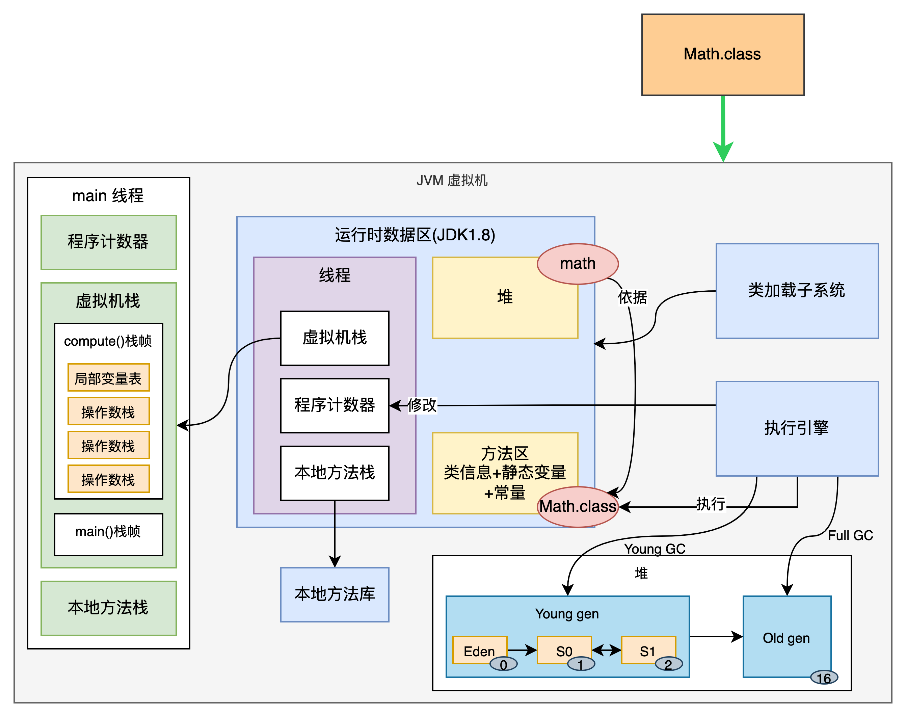
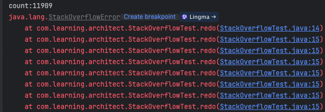
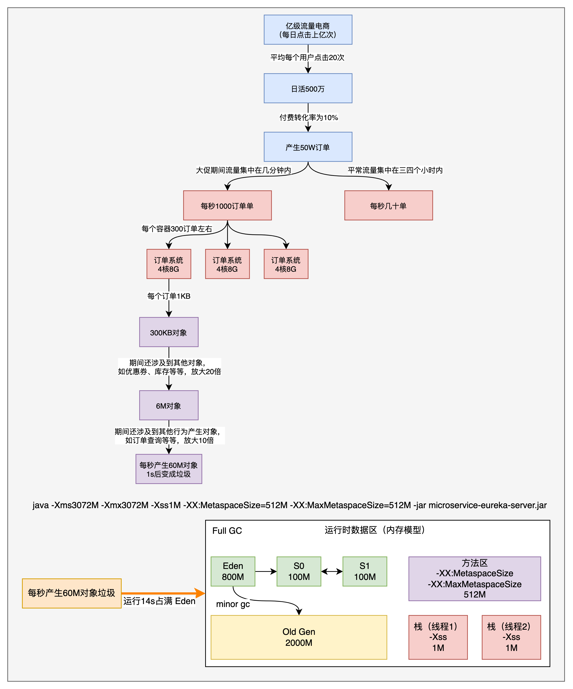

## JVM内存模型深度剖析与优化

### 1. JVM 内存模型一览

依据于 Math.java 执行流程一览 JVM 内存结构，如下图所示：



### 2. JVM 内存参数配置


Spring Boot程序的JVM参数设置格式(Tomcat启动直接加在bin目录下catalina.sh文件里)：

```
java ‐Xms2048M ‐Xmx2048M ‐Xmn1024M ‐Xss512K ‐XX:MetaspaceSize=256M ‐XX:MaxMetaspaceSize=256M ‐jar microservice‐eureka‐server.jar
```

-XX：MaxMetaspaceSize： 设置元空间最大值，默认是-1，即不限制，或者说只受限于本地内存大小。

-XX：MetaspaceSize：指定元空间触发Fullgc的初始阈值(元空间无固定初始大小)，以字节为单位，默认是21M，达到该值就会触发full gc进行类型卸载，同时收集器会对该值进行调整：如果释放了大量的空间，就适当降低该值；如果释放了很少的空间，那么在不超过-XX：MaxMetaspaceSize（如果设置了的话）的情况下，适当提高该值。这个跟早期jdk版本的-XX:PermSize参数意思不一样，-XX:PermSize代表永久代的初始容量。

由于调整元空间的大小需要Full GC，这是非常昂贵的操作，如果应用在启动的时候发生大量Full GC，通常都是由于永久代或元空间发生了大小调整，基于这种情况，一般建议在JVM参数中将MetaspaceSize和MaxMetaspaceSize设置成一样的值，并设置得比初始值要大，对于8G物理内存的机器来说，一般我会将这两个值都设置为256M。

StackOverflowError示例：

```java
public class StackOverflowTest {

    static int count = 0;

    public static void redo() {
        count ++;
        redo();
    }

    public static void main(String[] args) {
        try {
            redo();
        } catch (Throwable e) {
            System.out.println("count:" + count);
            e.printStackTrace();
        }
    }
}
```

运行结果：



结论：

-Xss设置越小count值越小，说明一个线程栈里能分配的栈帧就越少，但是对JVM整体来说能开启的线程数会更多。

日均百万级订单交易系统如何设置JVM参数



图描述：

1. 业务背景：亿级流量的订单系统，每日点击上亿，假设平均每个用户每日点击20次，那么日活就是500万（1亿➗20），而订单的整体转化率为 10%，因此每天产生的订单是50W（500万✖10%），若是在大促期间，可能大促持续几分钟（假设持续8分钟），若是日常，订单可能集中是三四个小时产生的
2. JVM 启动参数设置：java -Xms3072M -Xmx3072M -Xss1M -XX:MetaspaceSize=512M -XX:MaxMetaspaceSize=512M -jar microservice-eureka-server.jar
3. 若是大促的话，每秒产生的订单量大约是1K左右（50W➗8➗60） ;日常的话每秒大约也就几十单，因此按照大促期间的情况考虑
4. 后端有三台容器，负载均衡的情况下，大约每个容器接手300个订单，假设每个订单对象的大小是1K，那么每秒处理订单对象大小是300K
5. 订单还有许多关联的对象，比如用户信息、商品信息、优惠券信息等等，假设在此基础上放大20倍，那么每秒处理订单对象大小是6M
6. 而在处理订单的期间，可能还有一些其他的API能力被调用，比如订单查询、订单支付、订单取消等等，假设对象的数据大小再放大10倍，那么每秒处理订单对象大小是60M 
7. 每秒生产60M的对象，Eden 空间只有800M左右（3072M÷3÷10×8），14 秒 Eden 就满了，会出发 minor gc，这时大约有60M的对象是无法没回收的（其他的对象假设就使用1s，那么使用完就是垃圾了，只有最后1s产生的对象是无法回收的）
8. minor gc 理论上会将 Eden 无法回收的对象移到 Survivor 空间，但是 Survivor 大小是 100M（Eden:S0:S1=8:1:1），依据动态年龄分配策略需要将60M空间直接移动到老年代，而老年代大约2G空间，大约8分钟（2×1024÷60×14÷60，每14s产生60M垃圾，8分钟能将老年代填满）就要发生一个 full gc。
9. 这样的话每8分钟一次 full gc，是不被接受的，需要优化。
10. 由于年轻代生产的对象基本上都是很快消失的，而在回收的时候无法放入到 S0 导致的放到 Old Gen，所以调大年轻代的空间即可，比如设置年轻代为2G，老年代为1G，那么Eden大小为1.6G，S0和S1各200M。
11. 这样的话，大约27s发生一次minor gc（1.6×1024÷60），minor gc 完成之后大约有60M对象无法回收，将尝试放入 S0 区域，而 S0 区域放满之后，发生 minor gc，这时会将所有的对象回收，那么就不再可能会有对象生产到老年代上了，自然不会发生 full gc 了。
12. 优化后 JVM 启动参数设置：java -Xms3072M -Xmx3072M -Xmn2048M -Xss1M -XX:MetaspaceSize=512M -XX:MaxMetaspaceSize=512M -jar microservice-eureka-server.jar

本文大部分是实战解析，需要读懂计算垃圾回收步骤，会分析。