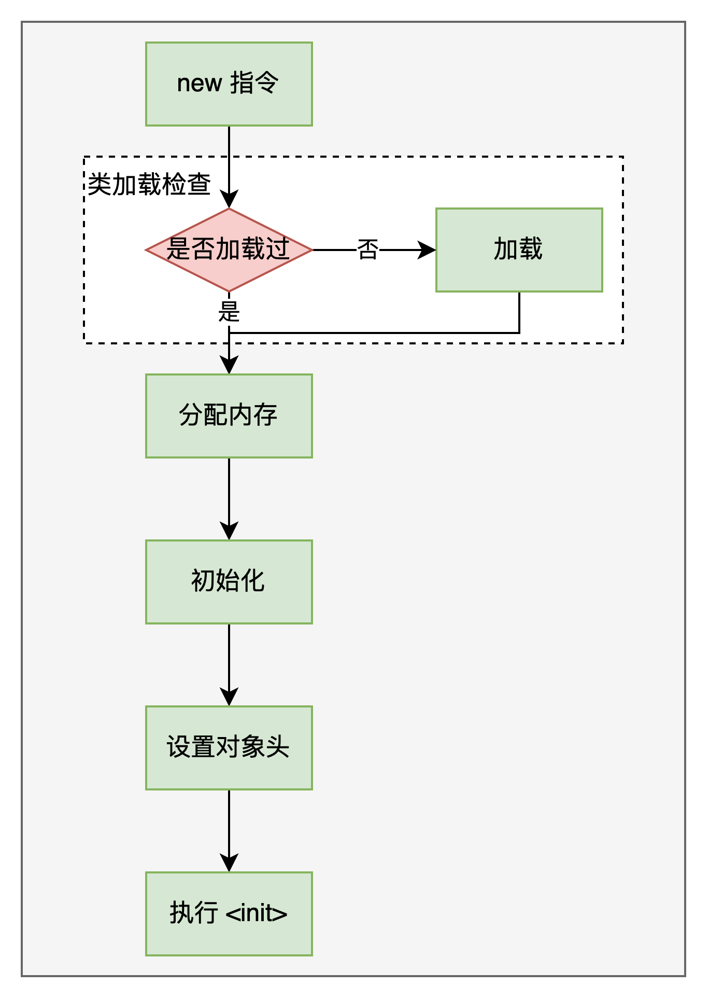
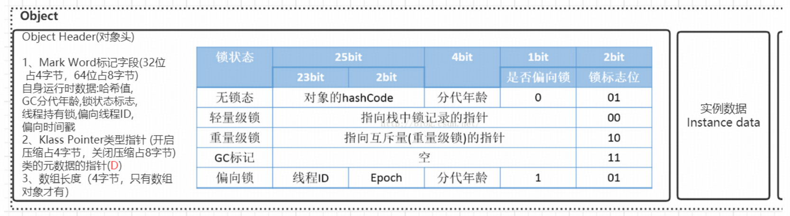
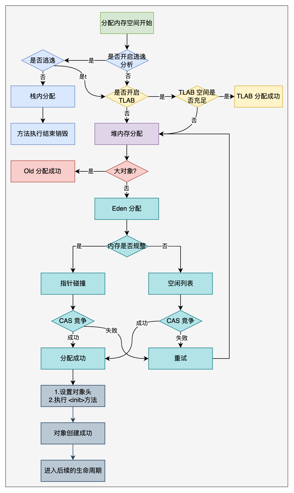
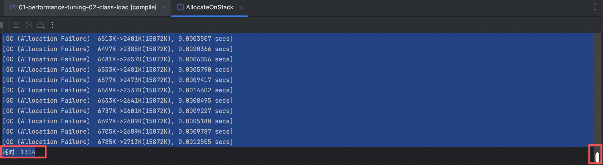
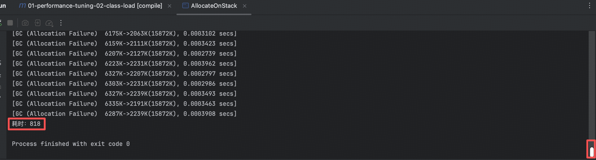
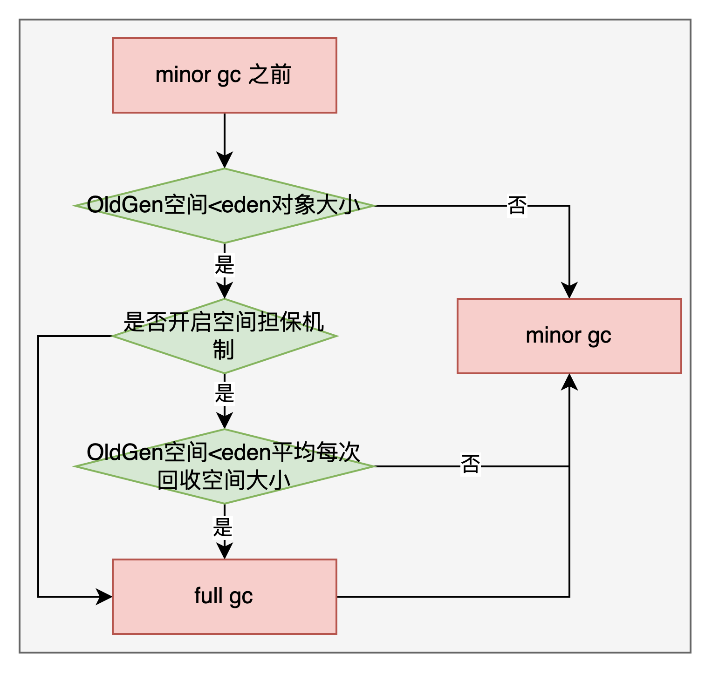
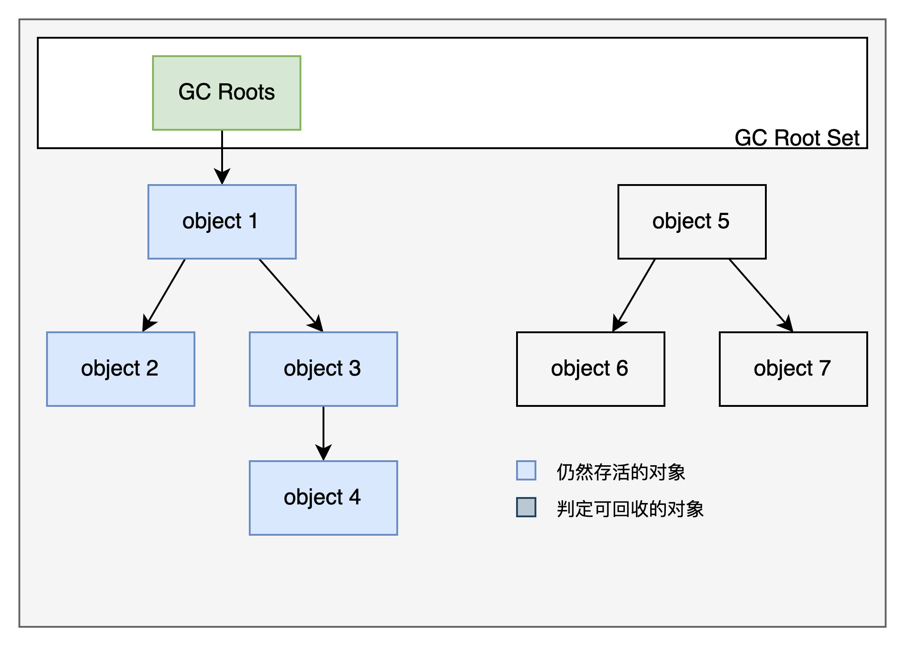

## JVM 对象创建与内存分配机制深度剖析

### 1. 对象创建



1. 类加载检查
   
    虚拟机遇到一条 new 指令后，首先去常量池中查找是否有对应的类的符号引用，并且检查该符号引用的类是否已经被加载、解析、初始化。如果没有则先进行类加载过程。
    
    new 指令对应到语言层面，new 关键词、对象克隆、对象序列化等。

2. 分配内存

    在类加载检查通过后，接下来虚拟机为新生对象分配内存。对象所需大小，在类加载完成后便可以完全确定，为对象分配空间的任务等同于把一块确定大小的内存从 Java 堆中划分出来。

    这个步骤有两个问题：
   1. 如何划分内存
   2. 分配内存

    划分内存的方法：

    * "指针碰撞"（默认）:如果Java堆中内存是绝对规整的，所有使用的内存在一边，所有未使用的在另一边，中间放一个指针作为分界的指示器，那所分配的内存仅仅是那个指针向空闲的内存移动一段和对象相同大小的距离。
    * "空闲列表":如果Java堆上的内存并不是完整的，已使用的内存和空间的内存是相互交错的，那么就没办法使用简单的指针碰撞了，虚拟机会维护一个列表，记录哪些内存块是可用的，在分配内存的时候找到一个足够大的空间划分给对象实例，并更新表中的记录。

    解决并发问题的方法：
    * CAS：虚拟机采用CAS配上失败重试的方式保证更新操作的原子性来对分配内存空间的动作进行同步处理。
    * <span id="tlab_desc">本地线程分配缓冲(TLAB)：</span>把内存分配的动作按照线程划分在不同的空间之中进行，即每个线程在Java堆中预先分配一小块内存。通过-XX:+/- UseTLAB参数来设定虚拟机是否使用TLAB(JVM会默认开启-XX:+UseTLAB)，-XX:TLABSize 指定TLAB大小。
    

3. 初始化

    内存分配完成后，虚拟机需要将分配到的内存空间赋上零值（不包括对象头），如果使用TLAB，这一工作过程也可以提前至TLAB分配时进行。这一步操作保证了对象的实例字段在Java代码中可以不赋初始值就直接使用，程序能访问到这些字段的数据类型所对应的零值。

4. 设置对象头

    初始化零值之后，虚拟机要对对象进行必要的设置，例如这个对象是哪个类的实例、如何才能找到类的元数据信息、对象的哈希码、对象的GC分代年龄等信息。这些信息存放在对象的对象头Object Header之中。
   
    在HotSpot虚拟机中，对象在内存中存储的布局可以分为3块区域：对象头（Header）、 实例数据（Instance Data）和对齐填充（Padding）。 HotSpot虚拟机的对象头包括两部分信息，第一部分用于存储对象自身的运行时数据， 如哈希码（HashCode）、GC分代年龄、锁状态标志、线程持有的锁、偏向线程ID、偏向时 间戳等。对象头的另外一部分是类型指针，即对象指向它的类元数据的指针，虚拟机通过这个指针来确定这个对象是哪个类的实例。

    

5. 执行 <init>

    执行<init>方法，即对象按照程序员的意愿进行初始化。对应到语言层面上讲，就是为属性赋值（注意，这与上面的赋零值不同，这是由程序员赋的值），和执行构造方法。

    对象大小与指针压缩

    什么是Java的对象压缩？
   1. jdk 1.6 开始，在 64bit 的操作系统中，开始支持对象压缩
   2. jvm 配置参数 UseCompressedOops,compressed--压缩、oop(ordinary object pointer)--对象指针 
    
    为什么要进行指针压缩？
    
    1. 在64位平台的JVM中使用32位指针，内存使用会多出1.5倍左右，使用较大的指针在主内存和缓存之间移动数据，**占用较大带宽，同时 GC 也会有较大压力**。
    2. 为了减少64位平台下的内存消耗，启用指针压缩功能
    3. 在 jvm 中，32位地址最大支持4G内存（2的32次方），可以通过对对象的指针压缩编码、解码的方式进行优化，使得jvm只用32位地址可以支持更大的内存范围（32G）。
    4. 堆内存小于4G时，不需要启用指针压缩，jvm会直接去除高32位地址，即使用低虚拟地址空间
    5. 堆内存大于32G时，压缩指针会失效，会强制使用64位（即8字节）来对Java对象进行寻址，这就会出现1的问题，所以建议堆内存不要大于32G。
  
### 2. 对象内存分配



描述下整体流程：

1. 当对象生成的过程中需要进行内存分配的时候，首先会检查是否开启了逃逸分析
2. 若开启了逃逸分析，那么需要判断下该对象是否逃逸，若是未逃逸，则直接在栈上分配内存，随着栈的销毁而变为回收
3. 若是未开启逃逸分析或者未逃逸，则首先会判断一下是否开启了 TLAB ，若是开启了 TLAB ，则会判断 TLAB 空间是否充足
4. 若是 TLAB 空间充足，则在 TLAB 中分配内存
5. 若是未开启 TLAB 或 TLAB 空间不足，则直接在堆中（非 TLAB 的空间）分配内存
6. 在堆中分配优先判断对象是否是大对象，若是大对象，则直接在老年代中分配空间
7. 若不是大对象，则会在 Eden 中分配空间，在 Eden 中分配空间时，会判断 Eden 内的空间是否是规整的
8. 若是 Eden 内存是规整的，则会使用指针碰撞的方式来分配内存，若是 Eden 内存不是规整的，则会使用空闲列表的方式来分配内存
9. 分配内存时会发生 CAS 竞争，若是竞争成功了，则分配成功，后续继续其他的生命周期
10. 若是分配失败，则会进行重试

> 在这个流程中涉及到了特别多新名词，在这里介绍一下：
> 1. 逃逸分析是指方法内的对象的生命周期是否只在方法内，若是的话，则该对象是未逃逸对象，若在方法外还有引用，则是逃逸对象。（是否逃逸出了方法）
> 2. [TLAB](#tlab_desc) 是本地线程分配缓冲，即每个线程在Java堆的 Eden 区域会预先分配一小块区域（大约 Eden 的 1%），这个区域中的对象相当于是当前线程独享的，不会产生竞争问题。
> 3. CAS 在并发讲锁的时候会涉及，感兴趣可以先自己搜一下。
> 4. 标量替换（在栈上分配空间的一种方式）：通过逃逸分析确定该对象不会被栈外访问，并且该对象可以进一步拆分属性，jvm就不会创建该对象，而是将该对象拆解为若干个被这个方法使用的成员变量所替换，这样就不需要再栈上分配一大块连续的空间，进而导致空间不够。开启标量替换(-XX:+EliminateAllocations),JDK7以后默认开启。
> 5. 标量与聚合量：标量指不能再进一步分解的量，聚合量就是可以继续分解的量。

逃逸分析具体说明（参考[EscapeAnalysis.java](src/main/java/com/learning/architect/EscapeAnalysis.java)）：

开启逃逸分析jvm参数: -XX:+DoEscapeAnalysis

```java
public User test1() {
   User user = new User();
   user.setId(1);
   user.setName("HartLi");
   // TODO:保存到数据库
   // 此时 user 返回出了该方法，说明逃逸出去了
   return user;
}

public void test2() {
   User user = new User();
   user.setId(1);
   user.setName("HartLi");
   // TODO:保存到数据库
   // 此时 user 还在方法中，说明未逃逸
}
```

### 3. 对象在栈上分配

对象在栈上分配示例代码：

```java
/**
 * 栈上分配，标量替换
 * 代码调用了1亿次allocate()方法，如果分配到堆上，大概需要1G以上的空间，如果堆空间小于该值，必然会触发GC。
 *
 * 使用如下参数不会发生 GC
 * -Xmx15m -Xms15m -XX:+DoEscapeAnalysis -XX:+PrintGC -XX:+EliminateAllocations
 * 使用如下参数会发生大量 GC
 * -Xmx15m -Xms15m -XX:-DoEscapeAnalysis -XX:+PrintGC -XX:+EliminateAllocations
 * -Xmx15m -Xms15m -XX:+DoEscapeAnalysis -XX:+PrintGC -XX:-EliminateAllocations
 */
public class AllocateOnStack {

    public static void main(String[] args) {
        long start = System.currentTimeMillis();
        for (int i = 0; i < 100000000; i++) {
            allocate();
        }
        long end = System.currentTimeMillis();
        System.out.println("耗时：" + (end - start));
    }

    private static void allocate() {
        User user = new User();
        user.setId(1);
        user.setName("HartLi");
    }
}
```

jvm 参数设置为 `-Xmx15m -Xms15m -XX:+DoEscapeAnalysis -XX:+PrintGC -XX:+EliminateAllocations`:

```
[GC (Allocation Failure)  4096K->568K(15872K), 0.0098117 secs]
[GC (Allocation Failure)  4664K->544K(15872K), 0.0019399 secs]
[GC (Allocation Failure)  4640K->576K(15872K), 0.0023316 secs]
耗时：287
```

jvm 参数设置为 `-Xmx15m -Xms15m -XX:-DoEscapeAnalysis -XX:+PrintGC -XX:+EliminateAllocations`:

未开启逃逸分析，发生了大量 GC



jvm 参数设置为 `-Xmx15m -Xms15m -XX:+DoEscapeAnalysis -XX:+PrintGC -XX:-EliminateAllocations`:

未开启标量替换，发生了大量 GC



### 4. 对象在 Eden 分配

大多数情况下，对象在新生代中 Eden 区分配内存。当 Eden 内存不够用时，会触发 Minor GC。

Minor GC 和 Full GC 的区别：

* Minor GC/Young GC:指发生在新生代的垃圾收集动作，Minor GC 非常频繁，回收速度也非常快。
* Major GC/Full GC:一般会回收老年代、新生代、方法区的垃圾，Full GC的速度一般会比Minor GC的速度慢10倍以上。

Eden 内存满了后，会触发 Minor GC，Minor GC结束后，剩余的存活对象会被转移到 Survivor 区域。下一次 Eden 满了之后又会触发 Minor GC，这时会针对 Eden 和 S0 区域都进行垃圾回收，将存活对象移动到 S1 区域。

jvm 默认 Eden:S0:S1=8:1:1，另外jvm默认有一个参数-XX:+UseAdaptiveSizePolicy(默认开启)，会导致8:1:1的比例自动变化，可能会变成比例不是这样的。

```java
// 添加 JVM 参数： -XX:+PrintGCDetails
public class GCTest {

    public static void main(String[] args) {
        byte[] allocation1, allocation2, allocation3, allocation4, allocation5, allocation6;
        allocation1 = new byte[60000 * 1024];

//        allocation2 = new byte[8000 * 1024];
//        allocation3 = new byte[1000 * 1024];
//        allocation4 = new byte[1000 * 1024];
//        allocation5 = new byte[1000 * 1024];
//        allocation6 = new byte[1000 * 1024];

    }
}
```

运行结果：

```
Heap
 PSYoungGen      total 76288K, used 65243K [0x000000076ab00000, 0x0000000770000000, 0x00000007c0000000)
  eden space 65536K, 99% used [0x000000076ab00000,0x000000076eab6ea8,0x000000076eb00000)
  from space 10752K, 0% used [0x000000076f580000,0x000000076f580000,0x0000000770000000)
  to   space 10752K, 0% used [0x000000076eb00000,0x000000076eb00000,0x000000076f580000)
 ParOldGen       total 175104K, used 0K [0x00000006c0000000, 0x00000006cab00000, 0x000000076ab00000)
  object space 175104K, 0% used [0x00000006c0000000,0x00000006c0000000,0x00000006cab00000)
 Metaspace       used 3200K, capacity 4500K, committed 4864K, reserved 1056768K
  class space    used 352K, capacity 388K, committed 512K, reserved 1048576K
```

由上面的结果而知，Eden 区域基本上全部占满。若是再给 allocation2 分配内存，会发生什么？

```
[GC (Allocation Failure) [PSYoungGen: 62621K->640K(76288K)] 62621K->60640K(251392K), 0.0323183 secs] [Times: user=0.05 sys=0.03, real=0.03 secs] 
Heap
 PSYoungGen      total 76288K, used 11262K [0x000000076ab00000, 0x0000000774000000, 0x00000007c0000000)
  eden space 65536K, 16% used [0x000000076ab00000,0x000000076b55f8d8,0x000000076eb00000)
  from space 10752K, 5% used [0x000000076eb00000,0x000000076eba0000,0x000000076f580000)
  to   space 10752K, 0% used [0x0000000773580000,0x0000000773580000,0x0000000774000000)
 ParOldGen       total 175104K, used 60000K [0x00000006c0000000, 0x00000006cab00000, 0x000000076ab00000)
  object space 175104K, 34% used [0x00000006c0000000,0x00000006c3a98010,0x00000006cab00000)
 Metaspace       used 3200K, capacity 4500K, committed 4864K, reserved 1056768K
  class space    used 352K, capacity 388K, committed 512K, reserved 1048576K
```

放开`allocation2 = new byte[8000 * 1024];`注释，在给allocation2分配内存时，发现内存不够，发生了一次 Minor GC，发现allocation1无法分配到Survivor区域，则将allocation1移动到OldGen区域。 

若是将所有注释的代码全部放开：

```
[GC (Allocation Failure) [PSYoungGen: 62621K->640K(76288K)] 62621K->60640K(251392K), 0.0248392 secs] [Times: user=0.08 sys=0.02, real=0.03 secs] 
Heap
 PSYoungGen      total 76288K, used 14890K [0x000000076ab00000, 0x0000000774000000, 0x00000007c0000000)
  eden space 65536K, 21% used [0x000000076ab00000,0x000000076b8ea8a0,0x000000076eb00000)
  from space 10752K, 5% used [0x000000076eb00000,0x000000076eba0000,0x000000076f580000)
  to   space 10752K, 0% used [0x0000000773580000,0x0000000773580000,0x0000000774000000)
 ParOldGen       total 175104K, used 60000K [0x00000006c0000000, 0x00000006cab00000, 0x000000076ab00000)
  object space 175104K, 34% used [0x00000006c0000000,0x00000006c3a98010,0x00000006cab00000)
 Metaspace       used 3200K, capacity 4500K, committed 4864K, reserved 1056768K
  class space    used 352K, capacity 388K, committed 512K, reserved 1048576K
```

还是只发生了一次 Minor GC，因为后续的 allocation3 、allocation4 、allocation5 、allocation6 申请的内存空间 Eden 区域都可以满足，因此没有再发生 GC。

什么情况下对象会进入老年代？

* 大对象会直接进入老年代：JVM参数 -XX:PretenureSizeThreshold 可以设置大对象的大小，如果对象超过设置大小会直接进入老年代，不会进入年轻代，这个参数只在 Serial 和ParNew两个收集器下有效。
* 长期存活的对象会进入老年代：如果对象在 Eden 出生并经过第一次 Minor GC 后仍然能够存活，并且能被 Survivor 容纳的话，将被移动到 Survivor 空间中，并将对象年龄设为1。对象在 Survivor 中每熬过一次 MinorGC，年龄就增加1岁，当它的年龄增加到一定程度（默认为15岁，CMS收集器默认6岁，不同的垃圾收集器会略微有点不同），就会被晋升到老年代中。对象晋升到老年代的年龄阈值，可以通过参数 -XX:MaxTenuringThreshold 来设置。
* 动态年龄判断：在 Survivor 区域中，若是对象的大小超过了区域内存的 50%(-XX:TargetSurvivorRatio可以指定)，那么大于等于这批对象年龄最大值的对象会被直接移入到老年代。
* 空间担保机制：
  1. 在发生 minor gc 之前，需要计算老年代的剩余空间
  2. 若是老年代剩余空间大于等于年轻代所有对象之和（包括垃圾），则会直接发生 minor gc
  3. 若是老年代剩余空间小于年轻代所有对象之和（包括垃圾），再判断是否开启了空间担保机制
  4. 若是没有开启空间担保机制，则直接发生 full gc，再进行 minor gc
  5. 若是开启了空间担保机制，则会继续判断老年代剩余空间是否小于历史上年轻代的每次垃圾回收之后的对象总和
  6. 若是大于等于的话，直接发生 minor gc
  7. 若是小于的话，则会先发生 full gc，再进行 minor gc
  8. 若是再第 2、4、7 步发生 minor gc 之后，老年代仍然没有空间存储 minor gc 之后存活的对象，那么会发生 OOM。



### 5. 对象内存回收

#### 5.1 引用计数法

为每个对象创建一个计数器，当有一个地方引用对象时，计数器加1，当引用失效时，计数器减1，当计数器为0时，对象可以回收。

这个方法简单高效，但是有一个致命的问题：引用计数法无法处理循环引用。当一个对象与另一个对象互相引用时，他们两个的计数器始终都不会为0，那么垃圾回收器就无法回收他们。

```java
public class ReferenceCountGc {
    
    Object instance = null;

    public static void main(String[] args) {
        ReferenceCountGc objA = new ReferenceCountGc();
        ReferenceCountGc objB = new ReferenceCountGc();
        objA.instance = objB;
        objB.instance = objA;
        objA = null;
        objB = null;
    }
}
```

#### 5.2 可达性分析算法

将 "GC Roots" 对象作为起点，从这些节点开始向下搜索引用的对象，找到的对象都标记为非垃圾对象，其余未标记对象都是垃圾对象。

GC Roots 根节点：虚拟机的本地变量、静态变量、本地方法栈的变量等等



#### 5.3 常见引用类型

Java的引用类型：

* 强引用：普通的变量引用。
   `public static User user = new User();`
* 软引用：将对象用 SoftReference 软引用类型的对象包裹，正常情况下不会被回收，但是若是 GC 后发现空间仍然不足，就会把这些软应用回收掉。**高速缓存会用软引用实现**。
   `public static SoftReference<User> user = new SoftReference<>(new User());`
   软引用在实际中有重要的应用，比如浏览器的后退按钮。按后退时，这个后退时显示的网页内容是重新请求还是从缓存中取出的呢？需要看具体的实现策略：
  * 如果一个网页在浏览结束时进行内容回收，按回退查看前面浏览的页面时，需要重新构建
  * 如果将浏览过的网页存储到内存中会造成大量的浪费，甚至会造成内存溢出
* 弱引用：将对象用 WeakReference 弱引用类型的对象包裹，弱引用和没引用差不多，GC 会直接回收掉，很少用
* 虚引用：虚引用也称为幽灵引用或幻影引用，是一种最弱的引用关系，几乎不用

finalize() 方法将对象回收推迟

即使在可达性分析算法中不可达的对象，也并非是"非死不可"的，这时候他们暂时处于"缓刑"阶段，真正宣告死亡，至少要经历再次标记的过程。

标记的前提是对象在进行可达性分析后发现没有与 GC Roots 相连的引用链。

1. 第一次标记并进行一次筛选。
   
   筛选的条件是此对象是否有必要执行 finalize() 方法。当对象没有覆盖 finalize() 方法时，此对象将直接回收。
   
2. 第二次标记。

   如果对象覆盖了 finalize() 方法，finalize() 方法是对象逃脱死亡的最后一次机会，如果对象在 finalize() 方法中将该对象与引用链上的任何一个对象建立关联，则在第二次标记的的时候将它移出"即将回收"的集合。

> PS： 一个对象的 finalize() 只会被执行一次。

示例：

```java
public class FinalizeTest {

    public static void main(String[] args) {
        List<Object> list = new ArrayList<>();
        int i = 0;
        int j = 0;
        while (true) {
            list.add(new User2(i++, UUID.randomUUID().toString()));
            new User2(j--, UUID.randomUUID().toString());
        }

    }
}
```

如何判断一个类是无用的类？

1. 使用该类创建的对象已经全部被回收
2. 加载该类的类加载器被回收
3. 该类的 Class 对象没有任何地方在引用，也无法再任何地方通过反射访问该类的方法。

