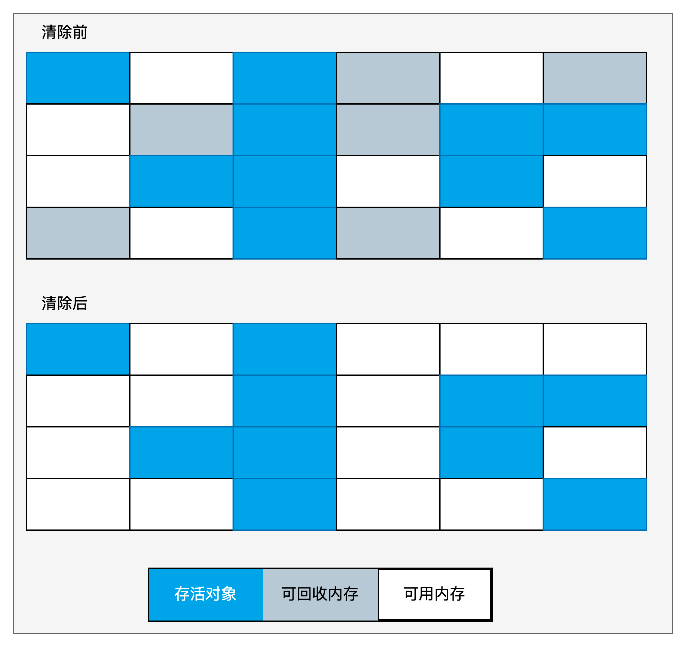
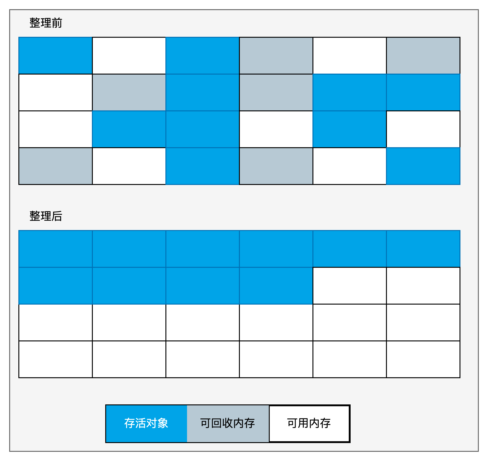
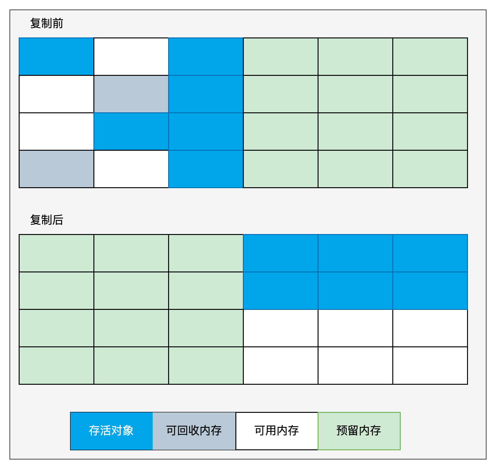
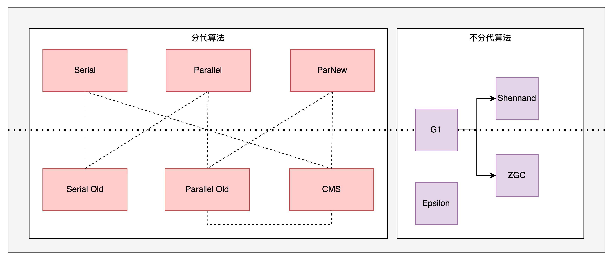
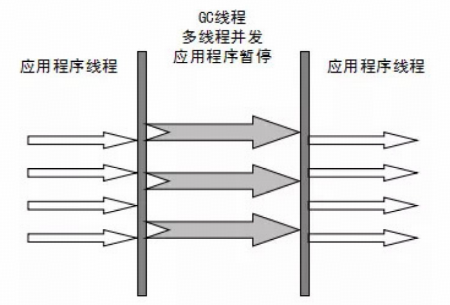
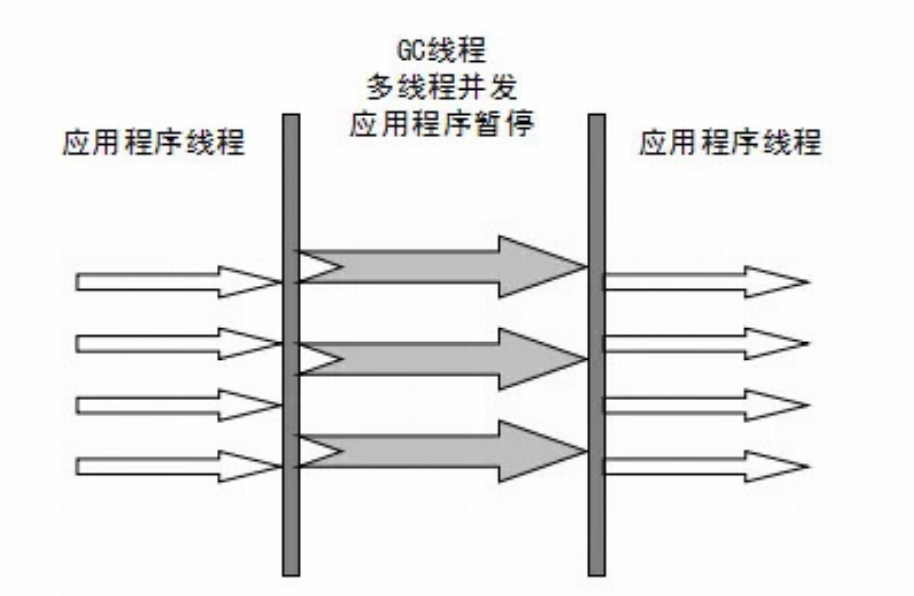
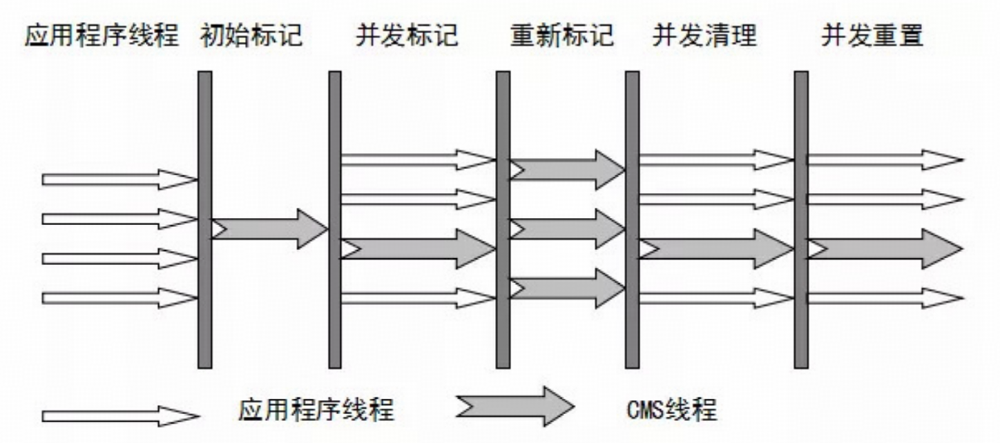

## 垃圾收集器ParNew&CMS与底层三色标记算法详解

### 1. 垃圾收集算法

垃圾收集算法主要有四种：

* 分代收集
* 标记-清除
* 标记-整理
* 复制算法

#### 分代收集算法

将堆空间分为新生代和老年代，根据不同代的特点采用不同的垃圾回收算法。

在新生代中，每次收集都会有大量（99%）对象需要回收，所以可以采用复制算法。而老年代在每次回收时对象存活下来的几率是比较高的，因此老年代一般采用标记-清除或标记-整理算法，标记-清除和标记-整理算法比复制算法慢10倍以上。

#### 标记-清除

算法分为标记和清除两个阶段，标记存活的对象，统一回收未被标记的对象（一般采用这种）；也可以反过来，标记所有需要回收的对象，在回收的时候统一回收标记的对象。该算法简单，但是存在很严重的问题： 空间碎片化严重。



#### 标记-整理

算法分为标记和整理两个阶段，标记存活的对象，整理阶段是将存活对象移动到低地址，然后清理掉临界之后的对象。



#### 复制算法

当一块内存使用完成之后，将还在存活的对象复制到另一块去，然后将之前的空间一次性清理掉。



### 2. 垃圾收集器



如果说垃圾收集算法是内存回收的方法论，那么垃圾收集器是垃圾收集的具体实现。

#### 2.1 Serial 收集器（-XX:+UseSerialGC -XX:UseSerialOldGC）

Serial 垃圾收集器采用 "**单线程**" 收集垃圾，而且他会停掉所有的用户线程（**STW**， Stop The World）。

新生代采用"**复制算法**"，老年代采用"**标记-整理**"。


Serial 的优势是**简单高效**。SerialOld 是 Serial 的老年代版本。

#### 2.2 Parallel Scavenge 收集器（-XX:UseParallelGC -XX:UseParallelOldGC）

Parallel 垃圾收集器实际上就是 Serial 的多线程版本，除了使用多线程进行垃圾收集外，其他行为（收集策略、收集算法、控制参数等等）和 Serial 相似。默认的收集线程和CPU核数一致，当然也可以通过-XX:ParallelGCThreads参数进行设置，一般不推荐修改。

Parallel 收集器关注点是吞吐量，CMS 等垃圾收集器更多的是关注用户停顿时间。吞吐量是指CPU中用于运行用户代码的时间与CPU总消耗时间的比值。

新生代使用复制算法，老年代使用标记-整理算法。



#### 2.3 ParNew 收集器（-XX:+UseParNewGC）

ParNew 垃圾收集器与Parallel 垃圾收集器类似，但是两者的不同之处在于它要配合CMS去使用。



#### 2.4 CMS 收集器（-XX:UseConcMarkSweepGC）

CMS 收集器是一种获取最短回收停顿时间为目标的收集器。

它的整个回收步骤分为四步：

1. 初始标记：暂停所有的用户线程，记录下 **GC Roots 直接引用的对象，过程很快** 。
2. 并发标记：从 GC Roots 直接引用的对象开始遍历查找整个对象链的过程，这个过程不需要停止用户线程，但是随之而来带来的问题是会出现对象状态标记改变的情况。
3. 重新标记：为了修正并发标记过程中因对象状态改变导致的状态不一致的情况，这个阶段停顿时间比初始标记要长，但是远远短于并发标记。主要使用三色标记中的增量更新算法。
4. 并发清理：对未标记的对象进行清理，这个过程不需要停止用户线程。（这个阶段若是有新增的标记为黑色的对象不需要进行清理）



优点：并发收集、低停顿。

缺点：
* CPU资源敏感（与用户线程争抢资源）
* 无法处理浮动垃圾（在并发标记和并发清理阶段又产生垃圾，这种浮动垃圾只能等到下一次gc再清理了）
* 使用 标记-清除 算法产生大量的空间碎片
* 执行的不确定性，有可能上一次垃圾收集还没执行完，下一次的垃圾回收开始了，特别是在并发标记和并发清理阶段，用户线程一边运行，垃圾回收也在进行，可能还没回收完又发生 Full GC，也就是 "concurrent mode failure"，此时会进入 STW，使用 serial old 进行回收。

CMS的相关核心参数:

* -XX:+UseConcMarkSweepGC：启用cms
* -XX:ConcGCThreads：并发的GC线程数
* -XX:+UseCMSCompactAtFullCollection：FullGC之后做压缩整理（减少碎片）
* -XX:CMSFullGCsBeforeCompaction：多少次FullGC之后压缩一次，默认是0，代表每次FullGC后都会压缩一次
* -XX:CMSInitiatingOccupancyFraction: 当老年代使用达到该比例时会触发FullGC（默认是92，这是百分比）
* -XX:+UseCMSInitiatingOccupancyOnly：只使用设定的回收阈值(-XX:CMSInitiatingOccupancyFraction设定的值)，如果不指定，JVM仅在第一次使用设定值，后续则会自动调整
* -XX:+CMSScavengeBeforeRemark：在CMS GC前启动一次minor gc，降低CMS GC标记阶段(也会对年轻代一起做标记，如果在minor gc就干掉了很多对垃圾对象，标记阶段就会减少一些标记时间)时的开销，一般CMS的GC耗时 80%都在标记阶段
* -XX:+CMSParallellnitialMarkEnabled：表示在初始标记的时候多线程执行，缩短STW
* -XX:+CMSParallelRemarkEnabled：在重新标记的时候多线程执行，缩短STW

#### 垃圾收集算法底层实现

##### 三色标记

在并发标记的过程中，因为标记期间应用线程还在继续跑，对象间的引用可能发生变化，多标和漏标的情况就有可能发生。漏标的问题主要引入了三色标记算法来解决。

三色标记算法是把Gc roots可达性分析遍历对象过程中遇到的对象， 按照“是否访问过”这个条件标记成以下三种颜色：

* 黑色：对象被访问过，且这个对象的所有引用全部被扫描过。不可被回收。黑色对象不可能直接指向某个白色对象。
* 灰色：对象被访问过，但是他的引用还有至少一个没有被扫描过。
* 白色：对象尚未被访问过，在分析结束之后，仍然是白色的对象，会被回收掉。


```java
/**
 * 垃圾收集之三色标记
 */
public class ThreeColorRemark {
    A a = new A();
    // 开始做并发标记
    D d = a.b.d;  // 读
    a.b.d = null; // 写
    a.d = d;      // 写

}

class A {
    B b = new B();
    D d = null;
}

class B {
    C c = new C();
    D d = new D();
}

class C {

}

class D {

}
```

##### 多标-浮动垃圾

在并发标记的过程中，由于方法运行结束导致部分 GC Root 失效，但是被这个 GC Root 扫描过的对象仍然被标记为黑色，那么这些对象就成为浮动垃圾，在本次收集不会被回收，只能等待下次垃圾回收再进行回收。

而针对并发标记期间产生的新对象，一般情况下都会直接标记为黑色，本轮垃圾回收是不会被回收的。

##### 漏标-读写屏障

漏标会导致某些引用的对象被误认为是垃圾而进行回收，会产生故障。解决该问题的办法有两个：**增量更新（Incremental Update）** 和 **原始快照（SATB, Snapshot at the beginning）**。

增量更新就是在并发标记的阶段若是有黑色对象引入了新的白色对象，那么会将这个引用放入到一个列表中，等到并发标记阶段结束时，再以这个列表中的黑色对象为根进行重新扫描。黑色对象一旦插入新的白色对象引用关系，则这个黑色对象就会变成灰色对象。

原始快照是当灰色对象要删除白色对象的引用关系时，将这个引用关系记录下来，在并发标记阶段结束后，再针对列表中的灰色对象为根进行重新扫描，这样若是能扫描到白色对象，则将白色对象记为黑色（目的是让这种对象在本轮GC中存活下来，待下一轮GC时重新扫描，也可能会变成浮动垃圾）。

* 写屏障

写屏障就是在就是在写对象的前后增加一个方法，可以在写对象之前或之后做一些操作，类似于 AOP。而 SATB 就是通过写屏障实现的。

* 读屏障

读屏障就是在读对象的前后增加一个方法，可以在读对象之前或之后做一些操作，类似于 AOP。而 增量更新 就是通过读屏障实现的。

CMS:写屏障+增量更新
G1:写屏障+SATB
ZGC:读屏障


### 面试题

1. 垃圾回收算法有哪些？
2. CMS 垃圾收集器整体流程包含哪些？
3. 并发标记期间若是产生了新的对象引用或者删除了新的对象引用，应该怎么处理？涉及到三色标记、增量更新、SATB、读写屏障
4. 漏标的问题如何处理？