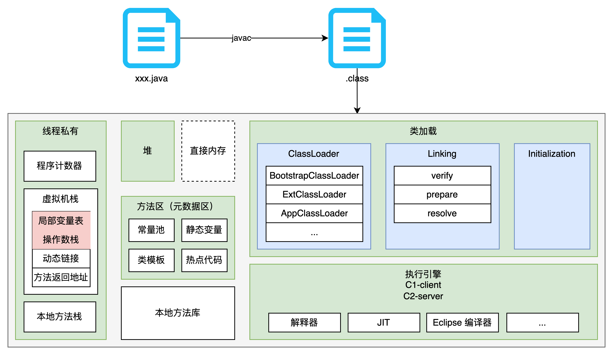
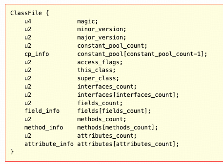
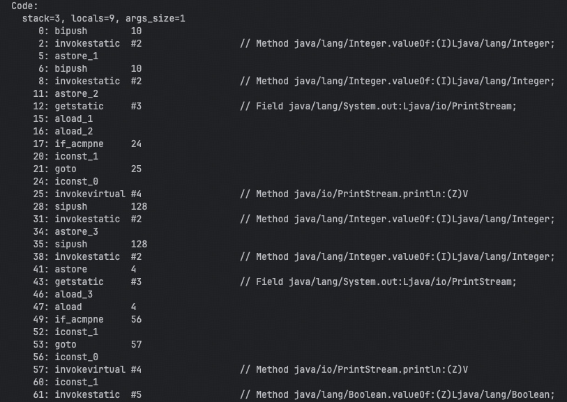

## 全面理解 JVM 虚拟机

[TOC]

JVM：Java 虚拟机，是Java程序运行的虚拟计算机环境。(后续讨论 JVM 都是以  为基础讨论，除非特殊说明)

### 1. JVM 的组成



整体流程： .java 文件 通过 javac 命令编译成 .class 文件，.class 文件加载进入 jvm 中，通过 加载 → 验证 → 准备 → 解析 → 初始化 → 使用 → 卸载 一系列的流程完成代码执行的整个生命周期。其中 JVM 组件包括两个系统和两个组件，两个系统分别为类加载子系统和执行引擎系统，而两个组件分别为运行时数据区（包括堆、栈、方法区等等）和本地方法库。

### 2. class 文件规范

#### 2.1 class 文件结构

编译 ByteCodeInterView.java 文件并打开，如下图所示：


如图所示，展示的是一堆 16 进制的内容。空格隔开的部分代表了 8 个bit，⽽每⼀位代表的是 4 个 bit字节，也就是⼀个⼗六进制的数字。

class 文件有一些固定的规范：

* 文件开头必须以 CAFEBABE 开头
* 文件的 BABE 后边的 0000 代表的 minor version（次版本号，一般没用），再之后的 0034 代表的是 major version（主版本号）,0034 换算为 10 进制是 52，代表的是 JDK1.8。低于该版本则无法执行该文件。

再往后的内容不太容易理解，可以使用 javap -v target.classes.com.roy.ByteCodeInterView 查看该 class 的详细信息。如下图所示：


官网定义的class文件结构要求如下所示：



前⾯u4表示四个字节是magic魔数，⽽这个魔数就是不讲道理的 CAFEBABE 。

后⾯的两个u2，表示两个字节的版本号。

接下来，class⽂件的整体布局就⽐较明显了。其中常量池是最复杂的部分，包含了表示这个class⽂件所需要的⼏乎所有常量。⽐如接⼝名字，⽅法名字等等。⽽后⾯的⼏个部分，⽐如⽅法，接⼝等都是引⽤常量池中的各种变量。

## 2.2 理解字节码指令

代码的字节码如下图所示：



这⾥每⼀行就是⼀个字节码指令。 JVM 虚拟机的字节码指令由⼀个字节⻓度的代表着某种特定操作含义的数字(称为操作码，OpCode)以及跟随其后的零⾄多个代表此操作所需要的参数(称为操作数，Operand)构成。其中操作数，可以是⼀个具体的参数，也可以是⼀个指向class⽂件常量池的符号引⽤，也可以是⼀个指向运⾏时常量池中的⼀个⽅法。⽐如第 0 ⾏ bipush 10，操作码就是 bipush，操作数就是 10。这个指令就占据了第 0 ⾏和第 1 ⾏两⾏。⽽有些操作码，如 astore_1，就只有⼀个操作码，没有操作数。

Java 虚拟机中的操作码的⻓度只有⼀个字节(能表示的数据是0～255)，这意味着 JVM 指令集的操作码总数不超过 256 条。这些指令相⽐于庞⼤的操作系统来说，已经是⾮常⼩的了。另外其中还有很多差不多的。 ⽐如aload_1，aload_2 这些，明显就是同⼀类的指令。具体可以参考

如果不考虑异常的话，那么 JVM 虚拟机执⾏代码的逻辑就应该是这样：

```
do{
从程序计数器中读取 PC 寄存器的值 + 1；
根据 PC 寄存器指示的位置，从字节码流中读取⼀个字节的操作码；
if(字节码存在操作数) 从字节码流中读取对应字节的操作数；
执⾏操作码所定义的操作；
}while(字节码流⻓度>0)
```

## 2.3 字节码指令解读案例

```java
Integer i1 = 10;
Integer i2 = 10;
System.out.println(i1 == i2);//true

Integer i3 = 128;
Integer i4 = 128;
System.out.println(i3 == i4);//false
```


如图所示，以前三行代码为例，分别对应着字节码 LineNumberTable 中的映射，LineNumberTable 中标注着第 10 行对应字节码的 0-5，11行代码对应字节码的 6-11，12行代码对应字节码的 12-27。

### 面试题

1. JVM 是什么，由什么组成？
2. Java 在 JVM 的整个声明周期内都干了什么?
3. class 文件是如何保证安全的？ class 文件验证
4. 