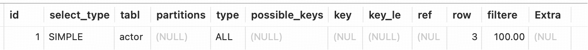
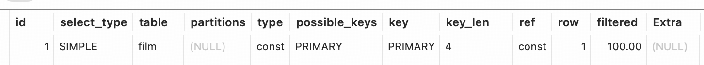
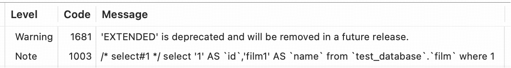

## Explain 详解与索引优化最佳实践

>MySQL 安装文档参考[这里](mysql_install/mysql_install.md)

### Explain工具介绍
使用EXPLAIN关键字可以模拟优化器执行SQL语句，分析你的查询语句或是结构的性能瓶颈。  

在 select 语句之前增加 explain 关键字	，MySQL 会在查询上设置一个标记，执行查询会返回执行计划的信息，而不是执行这条SQL。

注意：如果 from 中包含子查询，仍会执行该子查询，将结果放入临时表中。

### Explain分析示例
参考官方文档：https://dev.mysql.com/doc/refman/5.7/en/explain-output.html

示例表
```sql
DROP TABLE IF EXISTS `actor`; 
CREATE TABLE `actor` (
  `id` int(11) NOT NULL,
  `name` varchar(45) DEFAULT NULL,
  `update_time` datetime DEFAULT NULL,
  PRIMARY KEY (`id`)
) ENGINE=InnoDB DEFAULT CHARSET=utf8;

INSERT INTO `actor` (`id`, `name`, `update_time`) VALUES (1,'a','2017-12-22 15:27:18'), (2,'b','2017-12-22 15:27:18'), (3,'c','2017-12-22 15:27:18');

DROP TABLE IF EXISTS `film`;
CREATE TABLE `film` (
  `id` int(11) NOT NULL AUTO_INCREMENT,
  `name` varchar(10) DEFAULT NULL,
  PRIMARY KEY (`id`),
  KEY `idx_name` (`name`)
) ENGINE=InnoDB DEFAULT CHARSET=utf8;

INSERT INTO `film` (`id`, `name`) VALUES (3,'film0'),(1,'film1'),(2,'film2');

DROP TABLE IF EXISTS `film_actor`;
CREATE TABLE `film_actor` (
  `id` int(11) NOT NULL,
  `film_id` int(11) NOT NULL,
  `actor_id` int(11) NOT NULL,
  `remark` varchar(255) DEFAULT NULL,
  PRIMARY KEY (`id`),
  KEY `idx_film_actor_id` (`film_id`,`actor_id`)
) ENGINE=InnoDB DEFAULT CHARSET=utf8;

INSERT INTO `film_actor` (`id`, `film_id`, `actor_id`) VALUES (1,1,1),(2,1,2),(3,2,1);
```
执行 explain 
```sql
explain select * from actor;
```
结果如图所示：

在查询中的每个表会输出一行，如果有两个表通过 join 连接查询，那么会输出两行

### Explain 变种
> 本部分涉及的是 explain 执行之后展示的列的问题，忽略本部分影响不大~而且最新版本的 explain extended 和 explain partitions 的结果和 explain 是一致的。之前版本 explain 是会少 filtered 和 partitions 两个字段。 

- explain extended

    会在 `explain` 的基础上额外提供一些查询优化的信息。紧随其后通过 `show warnings` 命令可以得到优化后的查询语句，从而看出优化器优化了什么。额外还有 *`filtered`* 列，是一个百分比的值，`rows * filtered/100` 可以估算出将要和 `explain` 中前一个表进行连接的行数（前一个表指 `explain` 中的id值比当前表id值小的表）
    ```sql
    explain extended select * from film where id = 1;
    ```
  
    ```sql
    show warnings;
    ```
  
  show warnings 执行之后第一行是说明`extended`已经被废弃掉了，第二行说明是SQL优化后的结果。 
- explain partitions

  相比 explain 多了个 partitions 字段，如果查询是基于分区表的话，会显示查询将访问的分区。

### explain 列

1. id 列

id 编号是 select 的序列号，有几个 select 就有几个 id。
- id 越大，越先执行
- id 相同，从上往下执行

2. select_type 列

select_type 表示对应行是简单还是复杂的查询。

- simple：简单查询，查询中不包含子查询和 union
- primary：复杂查询中最外层的 select 
- subquery：包含在 select 中的子查询（）

3. table 列
4. type 列
5. possible_keys 列
6. key 列
7. key_len 列

