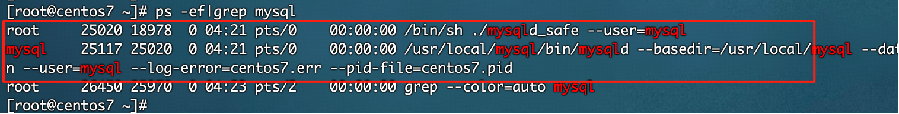
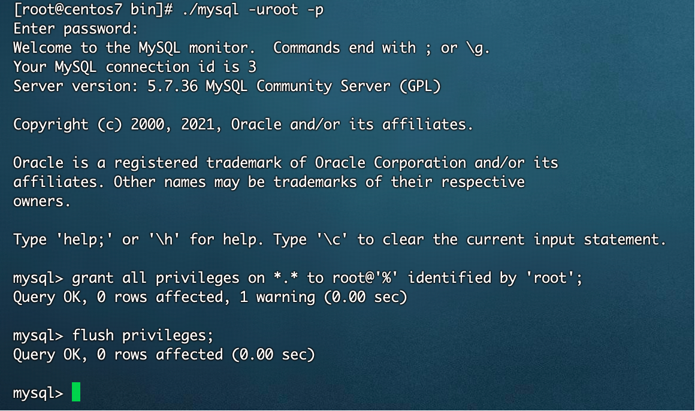

## MySQL 5.7 与 8.0 安装指南

0. **先卸载MariaDB**
>在CentOS中默认安装有MariaDB，是MySQL的一个分支，主要由开源社区维护。
CentOS 7及以上版本已经不再使用MySQL数据库，而是使用MariaDB数据库。
> 
> 如果直接安装MySQL，会和MariaDB的文件冲突。
> 
> 因此，需要先卸载自带的MariaDB，再安装MySQL。
 

0.1 查看版本
```shell
rpm -qa|grep mariadb 
```

0.2 卸载
```shell
rpm -e --nodeps 文件名
```
文件名需要替换成 grep 查询出来的文件名

0.3 查看卸载是否干净
```shell
rpm -qa|grep mariadb 
```


### MySQL 5.7 安装
#### 1. 下载 MySQL 5.7
```shell
wget https://mirrors.aliyun.com/mysql/MySQL-5.7/mysql-5.7.36-linux-glibc2.12-x86_64.tar.gz
```
检查是否本地已经安装了mysql
```shell
rpm -qa | grep mysql
```
卸载以前的mysql
```shell
rpm -e 已经存在的MySQL全名
```
已经存在的MySQL全名 是 grep 出来的文件名，若 grep 没有检索出信息，则不需要卸载


#### 2. 解压文件
```shell
tar -zxvf mysql-5.7.17-linux-glibc2.5-x86_64.tar.gz -C /usr/local/
```

文件名修改为mysql：
```shell
cd /usr/local/ && mv mysql-5.7.17-linux-glibc2.5-x86_64/ mysql
```

#### 3. 配置启动文件

3.1 然后去到mysql的support-files目录下,复制my.cnf到 /etc/my.cnf(mysqld启动时自动读取，若是没有这个文件就直接进行 3.2 步)
```shell
cd mysql/support-files/ && cp my-default.cnf /etc/my.cnf 
```
PS:若是 cp 命令执行出现 `cp: overwrite '/etc/my.cnf'?` 填写 yes，将 /etc/my.cnf 覆盖

3.2 配置数据库编码
```shell
vi /etc/my.cnf
```
按`i`键后添加以下内容
```
[mysql]
default-character-set=utf8mb4

[mysqld]
default-storage-engine=INNODB
character_set_server=utf8mb4
```
按 `wq` 保存

3.3 复制`mysql.server`到`/etc/init.d/`目录下(目的想实现开机自动执行效果)
```shell
cp mysql.server /etc/init.d/mysql
```

3.4 修改/etc/init.d/mysql参数
```shell
vi /etc/init.d/mysql
```

修改以下内容
```
basedir=/usr/local/mysql
datadir=/usr/local/mysql/data
```


3.5 出于安全便利，创建一个操作数据库的专门用户

建立一个mysql的组:
```shell
groupadd mysql
```

建立mysql用户，并且把用户放到mysql组:
```shell
useradd -r -g mysql mysql
```

给mysql用户设置一个密码:
```shell
passwd mysql
```

给目录/usr/local/mysql 更改拥有者:
```shell
chown -R mysql:mysql /usr/local/mysql/
```


#### 4. 初始化 mysql 的数据库

4.1 初始化数据库
```shell
cd /usr/local/mysql/bin/ && ./mysqld --initialize --user=mysql --basedir=/usr/local/mysql --datadir=/usr/local/mysql/data
```
PS:初始化后会生成一个临时密码 root@localhost:：*(最好先记录这个临时密码，我这里是 ",fFpga%lw5(V"，双引号内的都是密码)


有可能在这一步执行命令的时候遇到如下错误：
```
./mysqld: error while loading shared libraries: libaio.so.1: cannot open shared object file: No such file or directory
```


解决办法：<br />
```shell
yum install -y libaio.so.1
yum install -y libaio
```
可能执行该命令时又遇到了如下报错：
```shell
Could not retrieve mirrorlist http://mirrorlist.centos.org/?release=7&arch=x86_64&repo=os&infra=stock error was
14: curl#6 - "Could not resolve host: mirrorlist.centos.org; 未知的名称或服务"
```
该问题原因是CentOS7镜像找不到，具体原因不深入研究。下面说解决办法：
1. 备份repos文件
```shell
cp -v /etc/yum.repos.d/CentOS-Base.repo /etc/yum.repos.d/CentOS-Base.repo.backup
```
2. 修改/etc/yum.repos.d/CentOS-Base.repo文件
```shell
vi /etc/yum.repos.d/CentOS-Base.repo
```
3. 修改文件，改为如下内容：
```
[base]
name=CentOS-$releasever - Base
baseurl=https://vault.centos.org/7.9.2009/os/$basearch
gpgcheck=1
gpgkey=file:///etc/pki/rpm-gpg/RPM-GPG-KEY-CentOS-7

#released updates 
[updates]
name=CentOS-$releasever - Updates
baseurl=https://vault.centos.org/7.9.2009/updates/$basearch
gpgcheck=1
gpgkey=file:///etc/pki/rpm-gpg/RPM-GPG-KEY-CentOS-7

#additional packages that may be useful
[extras]
name=CentOS-$releasever - Extras
baseurl=https://vault.centos.org/7.9.2009/extras/$basearch
gpgcheck=1
gpgkey=file:///etc/pki/rpm-gpg/RPM-GPG-KEY-CentOS-7

#additional packages that extend functionality of existing packages
[centosplus]
name=CentOS-$releasever - Plus
baseurl=https://vault.centos.org/7.9.2009/centosplus/$basearch
gpgcheck=1
enabled=0
gpgkey=file:///etc/pki/rpm-gpg/RPM-GPG-KEY-CentOS-7
```
4. 保存退出（保存方法：按`esc`，然后输入`:wq`，回车确认）
5. 更新镜像源并清理缓存
```shell
yum clean all && yum makecache
```
6. 如果后面弹出是否下载的提示，全部输入y即可

4.2 给数据库加密
```shell
./mysql_ssl_rsa_setup --datadir=/usr/local/mysql/data
```

4.3 启动 MySQL
```shell
./mysqld_safe --user=mysql &
```


4.4 检查mysql是否启动
```shell
ps -ef|grep mysql
```
再开一个远程连接执行命令，发现有进程便代表启动成功。


#### 5. 进入客户端

5.1 登录
```shell
./mysql -uroot -p

Enter password:这里输入之前的临时密码
```

5.2 修改密码
```sql
set password=password('新密码');
```
PS:`新密码`需要替换成想要替换的密码


#### 6. 设置远程访问

6.1 打开mysql的默认端口3306
```shell
firewall-cmd --zone=public --add-port=3306/tcp --permanent && firewall-cmd --reload
```


6.2 设置mysql的远程访问

设置远程访问账号:grant all privileges on . to 远程访问用户名@’%’ identified by ‘用户密码’;
>PS：用户密码部分替换成自己期望的远程连接的密码
```sql
grant all privileges on *.* to root@'%' identified by 'zuifuzademima';
```
刷新权限
```sql
flush privileges;
```


#### 7. 设置开机自启动

7.1 添加服务mysql
```shell
chkconfig --add mysql
```
7.2 设置mysql服务为自启动
```shell
chkconfig mysql on
```


#### 8. 配置环境变量

```shell
vi /etc/profile
```

最后一行添加环境变量
```
export PATH=$JAVA_HOME/bin:/usr/local/mysql/bin:$PATH
```
使修改生效
```shell
source /etc/profile
```
至此，MySQL5.7的安装就完成了！


### MySQL 8.0 安装
#### 1. 安装MySQL
1.1 下载资源包
- 官网下载
```
https://dev.mysql.com/downloads/mysql/
```
- wget下载mysql 8.0.20
```shell
wget https://dev.mysql.com/get/Downloads/MySQL-8.0/mysql-8.0.20-linux-glibc2.12-x86_64.tar.xz
```

1.2 解压
```shell
.tar.gz后缀：tar -zxvf 文件名
.tar.xz后缀：tar -Jxvf 文件名
```

1.3 重命名
```shell
mv 原文件夹名 mysql8
```

1.4 添加PATH变量
```shell
vi /etc/profile
```
最后一行添加
```
export PATH=$PATH:/data/software/mysql8/bin
```
使环境变量生效
```shell
source /etc/profile
```

#### 2. 用户和用户组

2.1 创建用户组和用户
```shell
# 创建用户组：groupadd
# 创建用户：useradd
# -r：创建系统用户
# -g：指定用户组

# 创建一个用户组：mysql
groupadd mysql
# 创建一个系统用户：mysql，指定用户组为mysql
useradd -r -g mysql mysql
```

2.2 数据目录
创建目录
```shell
mkdir -p /data/software/mysql8/datas
```

赋予权限
```shell
# 更改属主和数组
chown -R mysql:mysql /data/software/mysql8/datas
# 更改模式
chmod -R 750 /data/software/mysql8/datas
```

#### 3. 初始化MySQL

3.1 配置参数
在/data/software/mysql8/下，创建my.cnf配置文件，用于初始化MySQL数据库
```
[mysql]
# 默认字符集
default-character-set=utf8mb4
[client]
port       = 3306
socket     = /tmp/mysql.sock

[mysqld]
port       = 3306
server-id  = 3306
user       = mysql
socket     = /tmp/mysql.sock
# 安装目录
basedir    = /data/software/mysql8
# 数据存放目录
datadir    = /data/software/mysql8/datas/mysql
log-bin    = /data/software/mysql8/datas/mysql/mysql-bin
innodb_data_home_dir      =/data/software/mysql8/datas/mysql
innodb_log_group_home_dir =/data/software/mysql8/datas/mysql
#日志及进程数据的存放目录
log-error =/data/software/mysql8/datas/mysql/mysql.log
pid-file  =/data/software/mysql8/datas/mysql/mysql.pid
# 服务端使用的字符集默认为8比特编码
character-set-server=utf8mb4
lower_case_table_names=1
autocommit =1
 
 ##################以上要修改的########################
skip-external-locking
key_buffer_size = 256M
max_allowed_packet = 1M
table_open_cache = 1024
sort_buffer_size = 4M
net_buffer_length = 8K
read_buffer_size = 4M
read_rnd_buffer_size = 512K
myisam_sort_buffer_size = 64M
thread_cache_size = 128
  
#query_cache_size = 128M
tmp_table_size = 128M
explicit_defaults_for_timestamp = true
max_connections = 500
max_connect_errors = 100
open_files_limit = 65535
   
binlog_format=mixed
    
binlog_expire_logs_seconds =864000
    
# 创建新表时将使用的默认存储引擎
default_storage_engine = InnoDB
innodb_data_file_path = ibdata1:10M:autoextend
innodb_buffer_pool_size = 1024M
innodb_log_file_size = 256M
innodb_log_buffer_size = 8M
innodb_flush_log_at_trx_commit = 1
innodb_lock_wait_timeout = 50
transaction-isolation=READ-COMMITTED
      
[mysqldump]
quick
max_allowed_packet = 16M
       
[myisamchk]
key_buffer_size = 256M
sort_buffer_size = 4M
read_buffer = 2M
write_buffer = 2M
        
[mysqlhotcopy]
interactive-timeout
```

3.2 初始化
```shell
# 参数（重要）
# defaults-file：指定配置文件（要放在–initialize 前面）
# user： 指定用户
# basedir：指定安装目录
# datadir：指定初始化数据目录
# intialize-insecure：初始化无密码

mysqld --defaults-file=/data/software/mysql8/my.cnf --basedir=/data/software/mysql8/ --datadir=/data/software/mysql8/datas/mysql --user=mysql --initialize-insecure
```

#### 4. 启动MySQL

查看 MySQL的 bin路径下，是否包含mysqld_safe，用于后台安全启动MySQL。


4.1 启动服务
```shell
# 完整命令
/data/software/mysql8/bin/mysqld_safe --defaults-file=/data/software/mysql8/my.cnf &
# 添加PATH变量后的命令（省略bin目录的路径）
mysqld_safe --defaults-file=/data/software/mysql8/my.cnf &
```
查看是否启动
```shell
ps -ef|grep mysql
```

4.2 登录
```shell
# 无密码登录方式
/data/software/mysql8/bin/mysql -u root --skip-password
# 有密码登录方式（初始的随机密码在/data/mysql8_data/mysql/mysql.log下）
mysql -u root -p
password:随机密码
```

4.3 修改密码
```sql
# 修改密码
ALTER USER 'root'@'localhost' IDENTIFIED WITH mysql_native_password BY '123456';
# 刷新权限
FLUSH PRIVILEGES;
```

4.4 设置允许远程登录
```sql
use mysql;
update user set user.Host='%'where user.User='root';
flush privileges;
quit;
```


