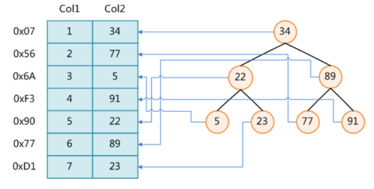
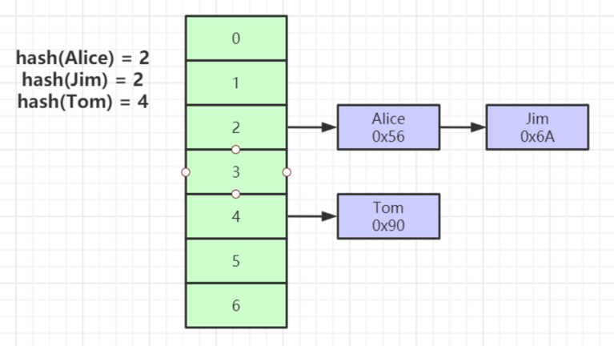
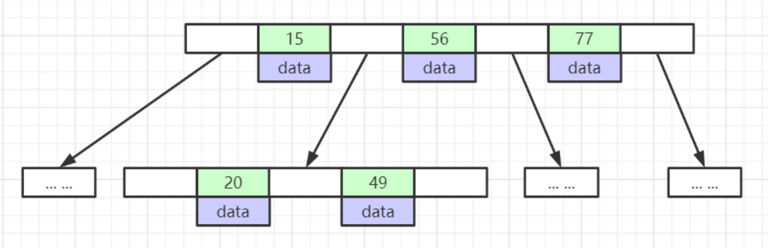
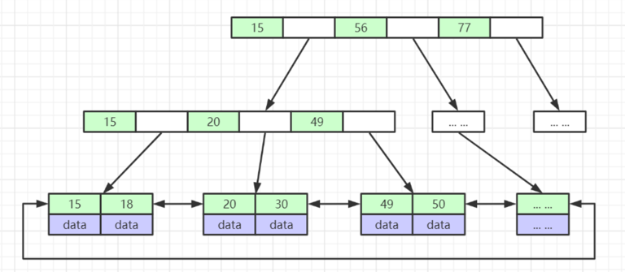
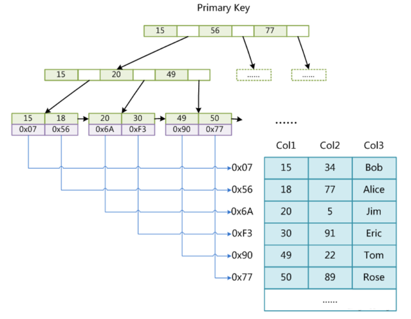
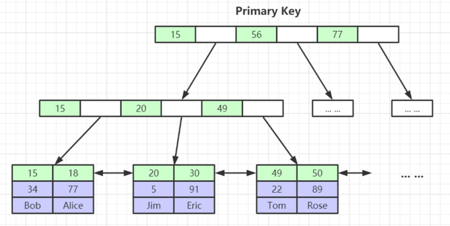
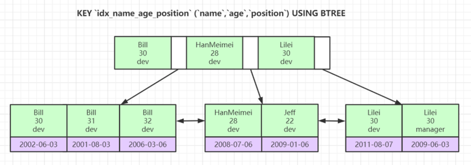

## 深入理解 MySQL 索引底层数据结构与算法
### 索引
 概念：索引是帮助 MySQL 高效获取数据的排好序的数据结构

 常见索引数据结构：

- 二叉树
- 红黑树
- Hash 表
- B-Tree

各种各样的数据结构地址可以参考该网站：https://www.cs.usfca.edu/~galles/visualization/Algorithms.html

#### 二叉树

数据结构特征：
- 0x** 代表数据对象地址
- Col1 代表的是插入数据的顺序
- Col2 代表的是索引数据



用在 MySQL 数据库上的优点与缺点\
优点：
- 结构简单，易于理解
- 平均查询复杂度 O(log n)

缺点：
- 极端情况下退化成链表(O(n))；
- 每个节点只存一个键值，树高极大，导致磁盘 I/O 暴增
- 不支持范围查询

使用场景：不适合数据库索引

#### Hash 表

数据结构特征：
- 绿色部分是提前分配好的内存空间
- 紫色部分是 hash 之后对应索引的数据链表（目前应该用红黑树优化了），链表上存储的数据是索引值及其数据行的地址



用在 MySQL 数据库上的优点与缺点\
优点：
- 精确查询速度极快(O(1))
- 无磁盘寻道问题（因为使用场景决定，使用场景主要是内存型的查询，所以自然不存在磁盘寻道问题）

缺点：
- 无法支持范围查询(>、<、BETWEEN)
- 不支持最左前缀匹配
- 哈希冲突影响性能
- 数据无序，大量磁盘随机 I/O

使用场景：等值查询（如缓存）、Memory 引擎（没有任何磁盘文件，所有索引和数据全部在内存中，如存储会话数据，不适合存储持久化数据，因为它有易失性）

#### B 树

数据结构特征：
- 根节点至少有两个子节点
- 每个中间节点都包含 k-1 个元素和 k 个孩子，其中 m/2 ≤ k ≤ m （m为树的阶）
- 每个叶子结点都包含 k-1 个元素，其中 m/2 ≤ k ≤ m （m为树的阶）
- 每个节点中的元素从小到大排列，节点中 k-1 个元素正好是 k 个孩子包含的元素的值域划分(一个结点有k个孩子时，必有k-1个元素才能将子树中所有元素划分为k个子集)



用在 MySQL 数据库上的优点与缺点\
优点：
- 矮胖树结构大幅减少 I/O
- 节点存储多键值
- 天然有序，支持范围查询
- 支持最左前缀

缺点：
- 非叶子节点也存储数据行指针，占用空间
- 范围查询需中序遍历，效率低于 B+Tree
- 空间利用率略低于 B+Tree

使用场景：早期的MySQL（MyISAM）

#### B+Tree 

数据结构特征：
- 有K个子节点的节点必然有K个关键码
- 非叶节点仅具有索引作用，元素信息均存放在叶节点中
- 树的所有叶节点构成一个有序链表，可以按照关键码排序的次序遍历全部记录

与 B-Tree 最大的区别：
1. 数据记录只在叶子结点记录，因此叶子上是所有的索引数据与数据记录
2. 叶子结点是一个双向循环链表（MySQL 数据库中是循环链表，标准的 B+Tree 是一个单向链表）



用在 MySQL 数据库上的优点与缺点\
优点：
- 更矮的树高（相同数据量比B-Tree矮30-50%）
- 范围查询极致优化（叶子节点双向链表）
- 更高的空间利用率（非叶子节点仅存键）
- 查询更稳定（所有查询到叶子层）

缺点：
- 实现比Hash复杂
- 精确查询略慢于Hash（但远快于二叉树）


使用场景：MySQL 默认的存储引擎（InnoDB）

### MySQL 数据库常见引擎及其索引

#### MyISAM 引擎

数据结构：
- 索引文件与数据文件是分开存储的

真实的索引与数据文件存储

| 文件类型    | 文件名    | 存储内容                              |
|---------|--------|-----------------------------------|
| 表结构定义文件 | 表名.frm | 表的结构定义（列名、类型、索引等元数据）              |
| 数据文件    | 表名.MYD | 实际数据行，按插入顺序堆叠（堆表）                 |
| 索引文件    | 表名.MYI | 索引数据（B+Tree 结构），包含主键/二级索引的节点指针和键值 |

查询示例：
```sql
SELECT * FROM users WHERE id = 100;
```
1. 从 users.MYI 中查找 id=100 的索引节点。
2. 获取数据行在 users.MYD 中的物理偏移量。
3. 从 .MYD 文件的对应位置读取数据。




#### InnoDB 引擎

数据结构：
- 数据文件本身就是按照 B+Tree 组织的一个索引数据结构（即数据文件是一个聚集索引）
- 索引文件内只存储非聚集索引
- 聚集索引：索引内存储了具体的数据记录
- 非聚集索引：索引内未存储具体的数据记录



真实的索引与数据文件存储

InnoDB 存储引擎的文件分为共享系统文件（位于 MySQL 数据目录）和每表独立文件（可配置）
- 通过 innodb_file_per_table=ON（默认开启）决定是否为每张表生成独立 .ibd 文件。
  - 开启时：数据和索引存于 表名.ibd。
  - 关闭时：所有表数据存于共享的 ibdata1。

- 共享系统文件

| 文件类型    | 文件名                          | 存储内容                                                                                                                               |
|---------|------------------------------|------------------------------------------------------------------------------------------------------------------------------------|
| 表结构定义文件 | 表名.frm                       | 表结构定义（MySQL 8.0+ 已移除，元数据存于系统表 information_schema）                                                                                  |
| 系统表空间文件 | ibdata1                      | 核心共享数据：<br><ul><li>数据字典（表/列/索引元数据）</l1><li>变更缓冲区（Change Buffer）</li><li> 回滚段（Undo Logs）</li><l1>双写缓冲区（Doublewrite Buffer）</li><ul> |
| 重做日志文件        | ib_logfile0 <br/>ib_logfile1 | **事务持久化的关键**：<br/>记录所有数据修改操作（物理日志），用于崩溃恢复。                                                                                         |

- 每表独立文件

| 文件类型    | 文件名    | 存储内容                                                                                |
|---------|--------|-------------------------------------------------------------------------------------|
| 独占表空间文件 | 表名.ibd | 该表的所有数据+索引（按 B+Tree 组织）：<ul><li> 叶子节点存储实际数据行（聚集索引）</li><li> 非叶子节点存储索引键+指针</li></ul> |

常见面试题：
- 为什么建议 InnoDB 表必须要建主键，并且推荐使用整型的**自增**主键？<br/>
若是没有建主键，MySQL会从表数据中选择一列所有值都不相同的列所谓主键，若是找不到这样的一列，则MySQL会建立一个隐藏列row_id来作为主键，尽量不要让MySQL做这些事情。
整型会有两个好处：
  - 比较两个整型要比比较两个非整型元素要快
  - 整型的存储空间占用小
自增的必要性：
  - 由于 B+Tree 根节点是双向循环链表并且 B+Tree 是一棵自平衡树，若是自增的，新增元素的时候索引开销是最小的

- 为什么非主键索引结构叶子结点存储的是主键值？\
有两个好处：
  - 有利于节省空间，整个数据记录一定是大于主键值的
  - 有利于保持数据记录的一致性，增删改只需要修改一处地方

联合索引

数据结构描述：
- 非叶子结点中存储的是组成联合索引的字段，并按顺序排序号
- 叶子结点中存储的是联合索引的字段，并且数据区域存储的是主键ID

数据结构图：
该图中的三个字段的联合索引组成了主键

